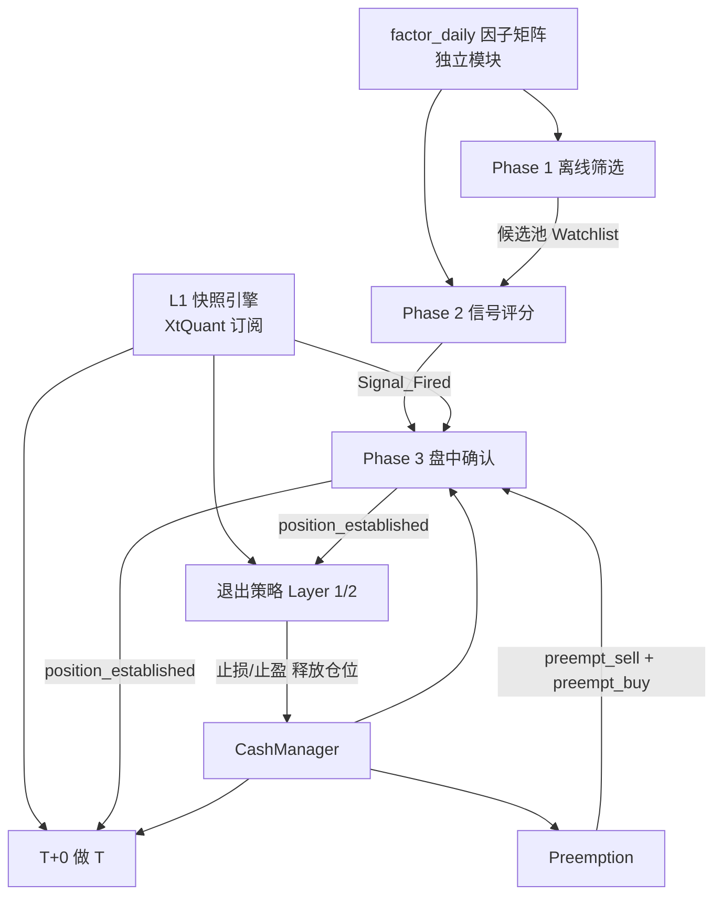

# ETF 入场策略 — 实现验证套件 v1.1

> **用途**：编码时与 `entry_strategy_specification.md` v1.3 配对使用。  
> 本文档包含编码合约、验收场景、断言清单、日志规范和模块依赖图。  
> 目标：让 AI 误读规格书导致的沉默逻辑错误在上线前被发现。

---

## Part 1：编码合约（MUST / MUST NOT）

> [!CAUTION]
> 以下每一条都是**硬约束**。违反任何一条都可能导致策略从盈利变为亏损。

### 1.1 Phase 2 评分

```
✅ MUST: 评分公式只包含以下 5 个信号，权重固定不变
  WEIGHTS = {
    "S_squeeze": 0.30,   # 二值 0/1
    "S_volume":  0.25,   # 二值 0/1
    "S_chip_pr": 0.20,   # 连续 [0, 1]
    "S_trend":   0.15,   # 二值 0/1
    "S_micro":   0.10,   # 连续 [0, 1]
  }

✅ MUST: score = round(sum(signal * weight), 2)  # 防止浮点 0.44999 误判
✅ MUST: 多维度门控 — score ≥ 0.45 AND (S_volume > 0 OR S_chip_pr > 0)

❌ MUST NOT: LLM sentiment 不参与评分。不得出现 sentiment * weight。
❌ MUST NOT: 不得动态调整权重。权重写死在代码中。
❌ MUST NOT: 不得在评分函数中引入任何规格书未定义的信号。
```

### 1.2 微观结构因子（S_micro）

```
✅ MUST: 消费微观结构引擎的 Daily Batch 输出文件
  数据源：data/factor_daily/{date}.parquet
  字段：vpin_filtered, ofi_daily, kyle_lambda, vs_max 等

❌ MUST NOT: 不要自行实现实时 VPIN/OFI 计算器。
❌ MUST NOT: 不要在盘中 L1 快照循环中计算微观因子。
   微观因子是 T 日收盘后批处理产出的，不是 T+1 盘中实时计算的。
```

### 1.3 LLM 情绪

```
✅ MUST: LLM sentiment 仅在以下两处使用：
  1) Phase 1 门控：sentiment_score ≥ 60 才进入候选池
  2) Phase 3 失效：sentiment_score < 40 → 取消入场 + 退出试探仓

❌ MUST NOT: sentiment 不进入 Phase 2 评分公式。
❌ MUST NOT: sentiment 不用于 Phase 3 确认建仓条件。
```

### 1.4 Phase 3 确认条件

```
✅ MUST: 确认建仓需要同时满足 5 个条件（a-e），缺一不可：
  a) price > H_signal（含跳空保护）
  b) VWAP 斜率上行（09:50 后才启用）
  c) IOPV 溢价率 ≤ threshold（试探 0.5% / 确认 0.3%）
  d) 当前时间 ≤ 14:30
  e) data_feed ≠ STALE（L1 新鲜度 ≤ 15 秒）

✅ MUST: 跳空保护
  gap_ratio = (last_price - H_signal) / H_signal
  gap_threshold = max(0.01, 0.5 * ATR_20 / Close_T)
  IF gap_ratio > gap_threshold → 禁止即时确认

✅ MUST: VWAP 数据窗口
  VWAP 累计从 09:30:00 开始，丢弃 09:15~09:29 的集合竞价快照
  IF snapshot.timestamp < 09:30:00 → 不纳入 Amount/Volume 累计

❌ MUST NOT: 不得在条件 a) 中遗漏跳空保护逻辑。
❌ MUST NOT: 09:50 前不得使用 VWAP 斜率做确认决策。
❌ MUST NOT: 不得将 09:30 前的 L1 快照纳入 VWAP 计算。
```

### 1.5 Preemption 抢占

```
✅ MUST: 触发条件全部满足：
  a) 当前持仓 = 2 只 ETF
  b) 新标的 Score_entry ≥ 0.85
  c) 至少 1 只弱势仓位

✅ MUST: 弱势仓位定义（ATR-relative）：
  类型 A：试探未确认
  类型 B：已确认 AND 浮盈 < 0.5 × ATR_20 AND 持有 ≥ 3 天

✅ MUST: 硬约束 — 浮盈 > 2% 的已确认仓位永远不可抢占。
✅ MUST: T+1 约束 — 弱势仓位必须已持有 ≥ 1 天。

✅ MUST: 降级路径
  IF T+2 弱势仓仍无法卖出 → 放弃抢占 + 抢占仓按失效退出 + 3 日冷却

✅ MUST: 执行前二次校验
  T+1 日 09:35 执行前，重新检查当前持仓数。
  IF 持仓 < 2（Layer 1 可能已止损清仓）→ 取消 Preemption，转常规入场。

✅ MUST: 先卖后买原则
  Preemption 默认先卖弱势仓，卖出成功后再买入新标的。
  30 分钟卖出未成交时可先动用备用金买入（临时 3 只）。

❌ MUST NOT: 不得抢占当日买入的仓位（T+1 卖出限制）。
❌ MUST NOT: 不得在非满仓状态下触发 Preemption（仓位 < 2 时直接开新仓即可）。
```

### 1.6 挂单价格

```
✅ MUST: 买入挂单价 = tick_ceil(min(Ask1 × 1.003, 涨停价))
✅ MUST: 失效卖出价 = tick_floor(max(Bid1 × 0.98, 跌停价))
✅ MUST: tick_ceil(x) = math.ceil(x * 1000) / 1000
✅ MUST: tick_floor(x) = math.floor(x * 1000) / 1000
✅ MUST: 所有挂单价 clamp 到 [跌停价, 涨停价] 区间
  涨停价 = prev_close × 1.10（ETF 通常 10%）
  跌停价 = prev_close × 0.90

❌ MUST NOT: 不得将买入价四舍五入（ceil 向上，不是 round）。
❌ MUST NOT: 不得将卖出价向上取整（floor 向下，不是 ceil）。
❌ MUST NOT: 不得提交超过涨停价的买单或低于跌停价的卖单。
```

### 1.7 资金管理

```
✅ MUST: 单只仓位上限 = 7 万，双持仓 = 14 万，备用金 = 6 万
✅ MUST: 试探仓 = 仓位的 30%（普通） / 50%（强信号 ≥0.70）
✅ MUST: CashManager 管理 T+0 弹药与 Preemption 备用金竞争

❌ MUST NOT: 试探仓 + 确认仓总额不得超过 7 万/只。
❌ MUST NOT: Preemption 临时第 3 只仓位不得超过 4 万。
```

### 1.8 崩溃恢复

```
✅ MUST: 挂单提交后立即将状态更新为 TRIAL_PLACED/CONFIRM_PLACED，
  并记录委托编号 (order_id) 到 state.json。

✅ MUST: Preemption 触发时，在 state.json 中写入：
  preemption_active: true
  preempt_buy_order_id: "..." | null
  preempt_weak_sell_order_id: "..." | null

✅ MUST: 崩溃恢复时：
  1) 查询券商当日委托列表，对比 state.json 记录的 order_id
  2) IF 委托存在且未成交 → 选择等待或撤单
  3) IF 委托不存在且 state 为 PLACED → 标记失败并告警
  4) IF preemption_active=true → 检查买/卖各自状态，恢复到一致

✅ MUST: CashManager 的锁仓记录与撤单操作必须在同一 state 写入中完成
  （先写 state 再执行操作，保证崩溃后可重建现金状态）

❌ MUST NOT: 不得在挂单后、state 更新前有任何可能失败的操作。
❌ MUST NOT: 崩溃恢复后不查询券商实际委托就重新下单。
```

---

## Part 2：验收场景（19 个关键场景）

> [!IMPORTANT]
> 每个场景有明确输入和预期输出。全部通过才可进入影子模式。

### Phase 2 评分验收

| # | 场景 | 输入 | 预期结果 |
|:---:|:---|:---|:---|
| 1 | 正常触发 | S_sq=1, S_vol=1, S_chip=0, S_trend=0, S_micro=0 | score=0.55, 触发=✅ |
| 2 | 多维度门控拦截 | S_sq=1, S_vol=0, S_chip=0, S_trend=1, S_micro=0 | score=0.45, 触发=❌ |
| 3 | 筹码通过门控 | S_sq=1, S_vol=0, S_chip=0.8, S_trend=0, S_micro=0 | score=0.46, 触发=✅ |
| 4 | 分数不足 | S_sq=1, S_vol=0, S_chip=0.5, S_trend=0, S_micro=0 | score=0.40, 触发=❌ |
| 5 | 满分 | S_sq=1, S_vol=1, S_chip=1.0, S_trend=1, S_micro=1.0 | score=1.00, 触发=✅ |
| 6 | LLM 不影响评分 | 同场景 1，但 sentiment=95 | score=0.55 不变 |
| 7 | 浮点精度 | S_sq=1, S_vol=0, S_chip=0.75, S_trend=1, S_micro=0 | score=0.60 (不是 0.5999...) |

### Phase 3 确认验收

| # | 场景 | 输入 | 预期结果 |
|:---:|:---|:---|:---|
| 8 | 跳空保护触发 | H_signal=1.00, price=1.035, ATR=0.015 | gap=3.5% > max(1%, 0.75%) → 拒绝即时确认 |
| 9 | 正常突破 | H_signal=1.00, price=1.005, ATR=0.015 | gap=0.5% < 1% → 允许确认 |
| 10 | IOPV 溢价拦截 | price=1.010, iopv=1.003, 确认仓 | premium=0.70% > 0.3% → 暂缓 |
| 11 | IOPV 数据缺失 | iopv=None | 跳过溢价检查，按其他条件判断 |
| 12 | VWAP 热身期 | 时间=09:40 | 跳过 VWAP 斜率，仅用价格判定 |
| 13 | 尾盘截止 | 时间=14:35 | 拒绝确认建仓 |

### Preemption 验收

| # | 场景 | 输入 | 预期结果 |
|:---:|:---|:---|:---|
| 14 | 不抢占盈利仓 | 持仓 2 只, 仓位 A 浮盈+3%, 新 Score=0.90 | 不抢占仓位 A（>2% 保护） |
| 15 | ATR 弱势判定 | 仓位 B: 浮盈+0.8%, ATR=2.0%, 持有 4 天 | 0.8% < 0.5×2.0%=1.0% 且 ≥3d → 弱势=✅ |

### 涨跌停 / 数据边界验收

| # | 场景 | 输入 | 预期结果 |
|:---:|:---|:---|:---|
| 16 | 买入价超涨停 | Ask1=1.095, prev_close=1.000 | 涨停=1.100, min(1.095×1.003, 1.100)=1.099 → 正常 |
| 17 | 买入价触涨停 | Ask1=1.098, prev_close=1.000 | 1.098×1.003=1.101 > 1.100 → clamp 到 1.100 |
| 18 | 集合竞价数据 | timestamp=09:22:15 | VWAP 累计不包含此快照 |
| 19 | Preemption 持仓变化 | Score=0.90, 但 Layer 1 已止损 1 只→持仓=1 | 取消 Preemption，转常规入场 |

---

## Part 3：运行时断言清单

以下断言必须嵌入代码中，运行时违反则立即报警并阻止执行。

```python
# ===== Phase 2 =====
assert set(signals.keys()) <= {"S_squeeze","S_volume","S_chip_pr","S_trend","S_micro"}, \
    f"非法信号: {set(signals.keys()) - valid_keys}"

assert 0 <= score <= 1.0, f"Score 越界: {score}"

if score >= 0.45:
    assert signals.get("S_volume", 0) > 0 or signals.get("S_chip_pr", 0) > 0, \
        "多维度门控: 纯 Squeeze+Trend 不可独立触发"

# ===== Phase 3 =====
if gap_ratio > gap_threshold:
    assert action != "CONFIRM_ENTRY", \
        f"跳空 {gap_ratio:.1%} 超阈值，不应确认"

if current_time < datetime.time(9, 50):
    assert not used_vwap_slope, \
        "09:50 前不应使用 VWAP 斜率判定"

if current_time > datetime.time(14, 30):
    assert action != "CONFIRM_ENTRY", \
        "14:30 后禁止建仓"

# ===== Preemption =====
for pos in current_positions:
    if pos.unrealized_pnl_pct > 0.02:
        assert pos.id not in preemption_candidates, \
            f"浮盈 {pos.unrealized_pnl_pct:.1%} > 2%，不可抢占"

# ===== 挂单价格 =====
limit_up = math.floor(prev_close * 1.10 * 1000) / 1000
limit_down = math.ceil(prev_close * 0.90 * 1000) / 1000

assert buy_price <= limit_up, \
    f"买入价 {buy_price} 超过涨停价 {limit_up}"
assert sell_price >= limit_down, \
    f"卖出价 {sell_price} 低于跌停价 {limit_down}"

# ===== VWAP 数据边界 =====
for snapshot in vwap_snapshots:
    assert snapshot.timestamp >= datetime.time(9, 30), \
        f"VWAP 包含 09:30 前的快照: {snapshot.timestamp}"

# ===== Preemption 二次校验 =====
if preemption_triggered:
    assert len(current_positions) >= 2, \
        f"Preemption 触发但持仓仅 {len(current_positions)}，应转常规入场"

# ===== 资金 =====
assert position_value <= 70000, \
    f"单只仓位 {position_value} 超过 7 万上限"
```

---

## Part 4：决策日志规范

> [!IMPORTANT]
> 每次信号评估、入场决策、拒绝决策都必须写日志。日志是发现沉默错误的唯一手段。

### 4.1 Phase 2 评分日志

```json
{
  "type": "PHASE2_SCORE",
  "timestamp": "2026-03-15 16:30:00",
  "etf_code": "159915",
  "signals": {
    "S_squeeze": 1, "S_volume": 1, "S_chip_pr": 0.72,
    "S_trend": 1, "S_micro": 0.45
  },
  "score": 0.79,
  "diversity_gate": true,
  "decision": "SIGNAL_FIRED",
  "note": "强信号 ≥0.70，确认期 T+1~T+2"
}
```

### 4.2 Phase 3 决策日志

```json
{
  "type": "PHASE3_DECISION",
  "timestamp": "2026-03-16 09:52:03",
  "etf_code": "159915",
  "action": "CONFIRM_ENTRY",
  "conditions": {
    "a_price_breakout": {"pass": true, "last_price": 1.523, "H_signal": 1.510},
    "a_gap_check": {"pass": true, "gap_ratio": 0.0086, "threshold": 0.01},
    "b_vwap_slope": {"pass": true, "warmup_active": false, "slope_values": [1.515, 1.518, 1.521]},
    "c_iopv_premium": {"pass": true, "premium": 0.0012, "threshold": 0.003},
    "d_time_cutoff": {"pass": true, "current_time": "09:52"},
    "e_data_fresh": {"pass": true, "staleness_sec": 2.1}
  },
  "order": {"price": 1.528, "quantity": 3200, "amount": 48896}
}
```

### 4.3 拒绝日志（同样重要）

```json
{
  "type": "PHASE3_REJECTED",
  "timestamp": "2026-03-16 09:36:15",
  "etf_code": "159915",
  "reason": "GAP_TOO_LARGE",
  "details": {
    "gap_ratio": 0.032, "threshold": 0.01,
    "action_taken": "等待回踩或 10:00 后 VWAP 确认"
  }
}
```

### 4.4 每日审计检查项

你每天花 **2 分钟** 看以下内容，就能发现大部分沉默错误：

```
❓ 1. 今天有多少 SIGNAL_FIRED？（正常 0-2 个，>5 个 = 阈值可能有问题）
❓ 2. 有没有 diversity_gate = false 但仍然 SIGNAL_FIRED 的？（= 门控没实现）
❓ 3. Phase 3 拒绝的原因分布？（gap/vwap/iopv/time/stale 各占多少）
❓ 4. 所有 conditions 里有没有某个字段永远是 true？（= 可能写死了 pass）
❓ 5. 挂单价是否一致？（买入总是 ceil，卖出总是 floor）
```

---

## Part 5：模块依赖图与编码顺序

### 5.1 依赖关系



### 5.2 推荐编码顺序

```
阶段 1 — 离线管线（无实时依赖，可独立测试）
  ① factor_daily 因子矩阵生成
  ② Phase 1 离线筛选
  ③ Phase 2 信号评分
  → 验收：场景 1-7 全部通过

阶段 2 — 盘中核心（依赖 L1 引擎）
  ④ L1 快照引擎（XtQuant 订阅 + 3 秒推送）
  ⑤ Phase 3 盘中确认（含跳空保护/VWAP热身/IOPV门控）
  ⑥ 挂单执行模块（easytrader 封装）
  → 验收：场景 8-13 全部通过

阶段 3 — 状态管理（依赖前两阶段）
  ⑦ CashManager（T+0 弹药 vs Preemption 竞争）
  ⑧ Preemption 抢占逻辑
  ⑨ state.json 持久化 + 崩溃恢复
  → 验收：场景 14-15 全部通过

阶段 4 — 数据归档
  ⑩ 入场事件日志（Part 4 格式）
  ⑪ 近失事件归档
  ⑫ 日度因子矩阵归档
```

### 5.3 关键接口定义

```python
# === 各模块之间的数据契约 ===

# Phase 1 → Phase 2
class WatchlistItem:
    etf_code: str           # ETF 代码
    sentiment_score: int    # LLM 评分 [0, 100]，≥60 才进入
    chip_resistance: str    # "LOW" | "MEDIUM" | "HIGH"

# Phase 2 → Phase 3
class SignalFired:
    etf_code: str
    score: float            # round(x, 2)，≥0.45
    is_strong: bool         # score ≥ 0.70
    H_signal: float         # 信号日最高价
    L_signal: float         # 信号日最低价
    signal_date: date       # T 日
    signals: dict           # 完整 5 信号快照
    # 确认窗口：strong → T+1~T+2，普通 → T+1~T+3

# Phase 3 → 退出策略
class PositionEstablished:
    etf_code: str
    entry_price: float      # 加权均价（试探 + 确认）
    entry_date: date
    total_shares: int
    atr_at_entry: float     # 用于退出策略的 ATR 基准

# 微观结构引擎 → Phase 2（文件接口，非 API）
# 读取：data/factor_daily/{date}.parquet
# 字段：vpin_filtered, ofi_daily, kyle_lambda, vs_max
```

---

## 附录：影子模式操作手册

```
影子模式 = 用真实行情 + 真实数据跑策略，但不真正下单

持续时间：20-30 个交易日

每天检查：
  1. 系统产生了哪些信号？（对比你手动按规格书判断的结果）
  2. Phase 3 确认了几次？拒绝了几次？拒绝原因是什么？
  3. 挂单价格合理吗？（和实际 Ask1/Bid1 差距多少？）
  4. CashManager 的资金分配正确吗？

退出影子模式的条件：
  ① 19 个验收场景全部通过（单元测试级）
  ② 连续 10 个交易日信号判断与手动判断一致
  ③ 无任何运行时断言触发
  ④ 日志格式完整，每日审计 5 项无异常
  ⑤ 至少经历过 1 次信号拒绝（验证防护机制工作）
```
