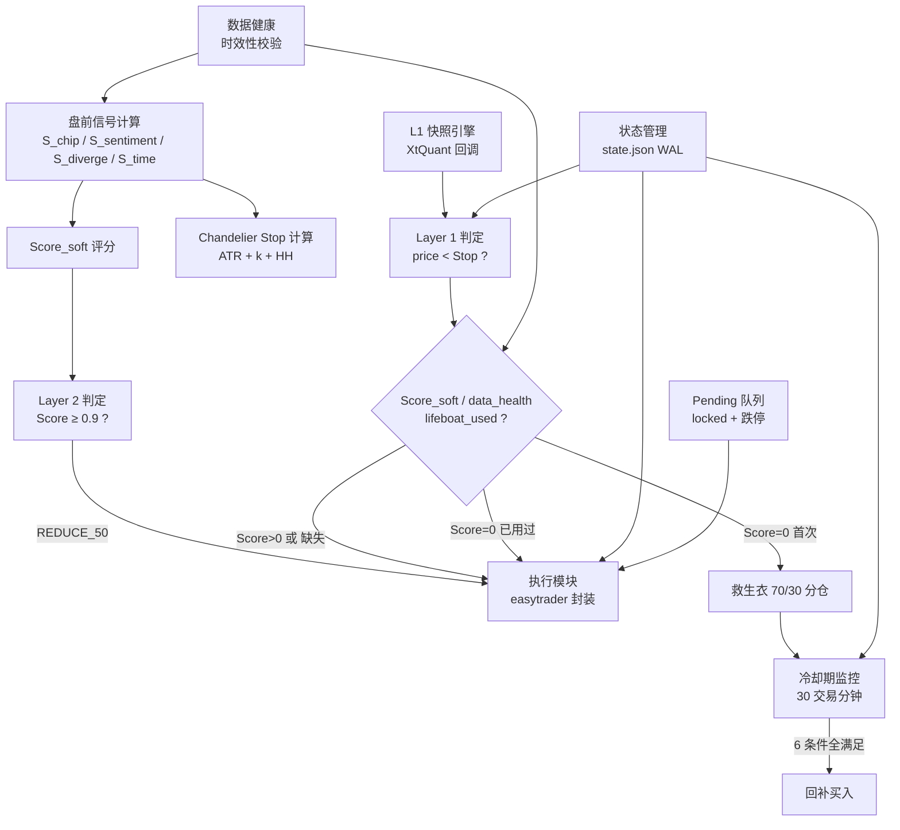

# ETF 退出策略 — 实现验证套件 v1.0

> **用途**：编码时与 `exit_strategy_specification.md` v4.1 配对使用。  
> 本文档包含编码合约、验收场景、断言清单、日志规范和模块依赖图。  
> 目标：让 AI 误读规格书导致的沉默逻辑错误在上线前被发现。

---

## Part 1：编码合约（MUST / MUST NOT）

> [!CAUTION]
> 以下每一条都是**硬约束**。违反任何一条都可能导致实盘亏损或账户风险。

### 1.1 Layer 1 / Layer 2 隔离

```
✅ MUST: Layer 1（硬止损）和 Layer 2（预警减仓）是两套完全独立的系统。
  Layer 1 判定条件：last_price < Stop（仅价格）
  Layer 2 判定条件：Score_soft ≥ 0.9（仅评分）
  两者之间的唯一联动：Layer 2 减仓后 k 从 2.8 收紧到 1.5

✅ MUST: Layer 1 触发后的行为由 Score_soft / data_health / lifeboat_used 决定。
  但触发本身只看价格 vs Stop，不看 Score_soft。

❌ MUST NOT: 不得在 Layer 1 的触发判定中引入 Score_soft。
  Score_soft 仅决定触发后的"力度"（100% 清仓 vs 70%+30% 救生衣），
  不决定是否触发。
❌ MUST NOT: 不得让 Layer 2 的预警减仓阻止或延迟 Layer 1 的硬止损。
```

### 1.2 Score_soft 评分

```
✅ MUST: 评分公式只包含以下 4 个信号，权重固定不变：
  WEIGHTS = {
    "S_chip":      0.7,   # 连续 [0, 1]（离散阶梯输出：0/0.3/0.5/0.7/1.0）
    "S_sentiment": 0.7,   # 二值 0/1
    "S_diverge":   0.5,   # 二值 0/1
    "S_time":      0.4,   # 二值 0/1
  }

✅ MUST: Score_soft = sum(signal * weight)
  理论值域 = [0, 2.3]
  触发阈值 = 0.9

✅ MUST: Score_soft = 0 意味着所有四个信号都为 0。
  这是一个精确的离散判定（不是浮点容差判定）。
  因为所有信号都是离散值，乘以固定权重后不存在浮点精度问题。

❌ MUST NOT: 不得动态调整权重。权重写死在代码中。
❌ MUST NOT: 不得在评分公式中引入规格书未定义的第五个信号。
❌ MUST NOT: S_trail（Chandelier Stop）不参与 Score_soft。
  S_trail 属于 Layer 1，与 Layer 2 完全独立。
❌ MUST NOT: 不得将 Score_soft 的 = 0 判定改为 < epsilon 容差判定。
  所有信号都是离散阶梯输出，Score_soft 在全绿时精确等于 0。
```

### 1.3 救生衣机制

```
✅ MUST: 救生衣仅在以下条件全部满足时启用：
  a) Layer 1 触发（last_price < Stop）
  b) Score_soft = 0（所有信号绿灯）
  c) 本波段未使用过救生衣（lifeboat_used = False）
  d) 数据完整（无 UNAVAILABLE 信号）

✅ MUST: 救生衣动作 = 卖 70%（从 sellable_qty 扣减），保留 30%
✅ MUST: 30% 救生衣仓位设独立超紧止损：再跌 1% → 立即清掉
✅ MUST: 记录 sell_time 到 state.json（用于冷却期计算）

✅ MUST: 回补条件（6 条全部满足）：
  a) 已过 30 个交易分钟（排除 11:30-13:00 午休）
  b) last_price > Stop
  c) Score_soft = 0
  d) data_feed ≠ STALE
  e) last_price > 跌停价 × 1.02
  f) 当前时间 ≤ 14:30

✅ MUST: 回补后标记 lifeboat_used = True（本波段不再触发救生衣）
✅ MUST: 回补后 70% 为 T+1 锁定股，日内不可卖出

❌ MUST NOT: 不得在 Score_soft > 0 时启用救生衣（有预警 → 直接清仓）。
❌ MUST NOT: 不得在数据缺失时启用救生衣（缺失 → 直接清仓）。
❌ MUST NOT: 不得在 14:30 后执行回补买入。
❌ MUST NOT: 不得在 lifeboat_used = True 后再次启用 70%/30% 分仓逻辑。
  第二次 Layer 1 触发 → 仅卖出 sellable_qty，T+1 锁定部分次日处理。
❌ MUST NOT: 冷却期不得使用自然时间（wall clock），必须使用交易分钟。
  11:30-13:00 午休期间不计时。
```

### 1.4 S_chip 信号计算

```
✅ MUST: S_chip 的输出是离散阶梯值：{0, 0.3, 0.5, 0.7, 1.0}
  Tier 1 贡献 +0.5，Tier 2 贡献 +0.3，Tier 3 贡献 +0.2
  S_chip = min(sum_of_tiers, 1.0)

✅ MUST: 前提条件 — profit_ratio ≥ 75%（否则 S_chip = 0，跳过全部 Tier）

✅ MUST: Tier 1（单日异动）：
  daily_drop = (DPC_t − DPC_{t-1}) / DPC_{t-1}
  触发：daily_drop ≤ −15%

✅ MUST: Tier 2（窗口趋势）：
  drop_days = 5 日窗口内 DPC 下降的天数（逐日比较 DPC_d < DPC_{d-1}）
  触发：drop_days ≥ 3
  注意：不要求连续下降，允许中间有反弹日

✅ MUST: Tier 3（累计确认）：
  total_drop = (DPC_t − DPC_{t-4}) / DPC_{t-4}
  触发：total_drop ≤ −20% AND drop_days ≥ 3

✅ MUST: 除零保护 —
  IF DPC_{t-1} < 0.01 → 跳过 Tier 1
  IF DPC_{t-4} < 0.01 → 跳过 Tier 3

✅ MUST: 冷启动 — 引擎运行 < 10 天 → S_chip = UNAVAILABLE

❌ MUST NOT: Tier 2 不要求严格连续下降。
  错误实现：consecutive_drops >= 3（中间一天反弹就清零）
  正确实现：count(DPC_d < DPC_{d-1} for d in window) >= 3
❌ MUST NOT: 不得用整个 DPC 值的绝对大小做判定（如 DPC < 0.5）。
  所有 Tier 都是基于变化率（百分比下降幅度）。
```

### 1.5 挂单价格

```
✅ MUST: Layer 1 卖出价 = max(跌停价, tick_floor(Bid1 × 0.98))
✅ MUST: Layer 2 卖出价 = tick_floor(Bid1)    # 无 0.98 折扣
✅ MUST: 救生衣回补买入价 = tick_ceil(Ask1 × 1.003)
✅ MUST: 死水区卖出价 = tick_floor(Bid1 × 0.98)

✅ MUST: tick_floor(x) = math.floor(x * 1000) / 1000
✅ MUST: tick_ceil(x) = math.ceil(x * 1000) / 1000
✅ MUST: 所有挂单价 clamp 到 [跌停价, 涨停价] 区间

❌ MUST NOT: Layer 2 卖出不得使用 Bid1 × 0.98（那是 Layer 1 专用）。
❌ MUST NOT: 不得提交低于跌停价的卖单。必须 max(跌停价, 计算价)。
❌ MUST NOT: 卖出不得用 ceil，买入不得用 floor。方向搞反 = 滑点 × 2。
```

### 1.6 T+1 持仓余额管理

```
✅ MUST: 每次卖出操作前，查询券商：
  total_qty（总持仓）
  sellable_qty（可用余额 = 可卖数量）
  locked_qty = total_qty - sellable_qty（T+1 锁定）

✅ MUST: 所有卖出指令只操作 sellable_qty，不得超过可用余额。
✅ MUST: 当存在 locked_qty > 0 且需要清仓时：
  卖出 sellable_qty + 写入 pending_sell_locked 到 state.json
  次日 09:30 自动挂卖 locked_qty（无条件执行）

❌ MUST NOT: 不得尝试卖出 locked_qty（会被券商拒绝）。
❌ MUST NOT: 次日挂卖 locked_qty 时不得"重新评估"是否应该卖。
  意图已在 Layer 1 触发时确定，T+1 只是技术延迟。
```

### 1.6.1 数量整手取整（新增硬约束）

```
✅ MUST: 买入委托 quantity 必须为 100 的整数倍（整手）。
  buy_qty_rounded = (buy_qty_raw // 100) * 100

✅ MUST: Layer 2 “减仓 50%” 的数量在 50% 计算后取整到 100 的倍数。
✅ MUST: 救生衣 “买回 70%” 的数量在 70% 计算后取整到 100 的倍数。

✅ MUST: 若 sellable_qty ≥ 100 但取整后为 0（例如小仓位 70% 被取整为 0），则至少下 1 手（100）。

✅ MUST: 卖出允许零股（odd-lot），不得为了整手取整而让“清仓意图”落空。
```

### 1.7 数据健康与降级

```
✅ MUST: 盘前 09:00 校验外部数据时效性：
  DPC 数据日期 ≠ 上一个交易日 → S_chip = UNAVAILABLE
  LLM 评分日期 ≠ 上一个交易日 → S_sentiment = UNAVAILABLE
  日线 OHLCV 日期 ≠ 上一个交易日 → S_diverge = UNAVAILABLE（重试至 09:15）

✅ MUST: Layer 1 触发时有任何信号 UNAVAILABLE → 100% 清仓，无救生衣
✅ MUST: 日常评分时信号 UNAVAILABLE → 缺失信号贡献 = 权重 × 0.5

❌ MUST NOT: 数据缺失时不得默认信号 = 0 (安全)。
  缺失 ≠ 安全。Layer 1 时缺失 = 最高风控（全清仓）。
❌ MUST NOT: 不得跳过外部数据时效性校验。
  筹码引擎/LLM 可能已崩溃数日但无人知晓。
```

### 1.8 L1 快照与持仓查询频率

```
✅ MUST: L1 快照通过 XtQuant 回调被动接收，不主动轮询。
✅ MUST: 持仓查询仅在以下时机进行：
  - 下单前（获取 sellable_qty）
  - 下单后（确认成交）
  - 定期 30 秒心跳（状态同步）

❌ MUST NOT: 不得每 3 秒通过 easytrader 查询持仓。
  easytrader 基于 GUI 自动化，频繁操作会触发券商风控或被踢下线。
❌ MUST NOT: 不得主动轮询 XtQuant 获取 L1 数据。使用回调订阅模式。
```

### 1.9 崩溃恢复

```
✅ MUST: 状态写入必须原子化：
  1. 写入 state.json.tmp
  2. os.replace("state.json.tmp", "state.json")
  永远不直接 open("state.json", "w")

✅ MUST: 系统启动时执行三步核对：
  1. 读取 state.json
  2. 查询券商实际持仓 (total_qty + sellable_qty)
  3. 查询当日在途委托 (未成交订单)

✅ MUST: 真相来源 = 券商持仓 + 当日委托，不是 state.json 或内存变量。

❌ MUST NOT: 不得在崩溃恢复后不查询在途委托就重新下单（防双重下单）。
❌ MUST NOT: 不得直接写入 state.json（永远先写 .tmp 再 replace）。
```

### 1.10 Chandelier Stop 动态收紧

```
✅ MUST: k 值收紧规则（三档）：
  正常（S_chip < 0.3）     → k = 2.8
  筹码恶化（S_chip ≥ 0.3） → k = 2.38（= 2.8 × 0.85）
  Layer 2 已减仓           → k = 1.5

✅ MUST: ATR 计算使用 Wilder EMA（周期 12）：
  ATR_t = (11/12) × ATR_{t-1} + (1/12) × TR_t

✅ MUST: HH = 入场以来所有日线最高价（持续更新，不重置）
✅ MUST: Stop = HH − k × ATR_t（盘前计算，盘中固定）

❌ MUST NOT: 不得在盘中实时更新 Stop。Stop 在盘前算好，盘中只做比较。
❌ MUST NOT: k 收紧后不可"恢复"（除非系统重置波段）。
  k 的方向是单调递减：2.8 → 2.38 → 1.5
```

---

## Part 2：验收场景（22 个关键场景）

> [!IMPORTANT]
> 每个场景有明确输入和预期输出。全部通过才可进入影子模式。

### Layer 2 评分验收

| # | 场景 | 输入 | 预期结果 |
|:---:|:---|:---|:---|
| 1 | 单信号不触发 | S_chip=0, S_sent=0, S_div=0, S_time=1 | Score=0.4, 触发=❌ |
| 2 | 两信号不够 | S_chip=0.5, S_sent=0, S_div=0, S_time=1 | Score=0.75, 触发=❌ |
| 3 | 筹码+情绪触发 | S_chip=0.5, S_sent=1, S_div=0, S_time=0 | Score=1.05, 触发=✅ |
| 4 | 情绪+动量触发 | S_chip=0, S_sent=1, S_div=1, S_time=0 | Score=1.20, 触发=✅ |
| 5 | 三信号组合 | S_chip=0.5, S_sent=0, S_div=1, S_time=1 | Score=1.25, 触发=✅ |
| 6 | 全满分 | S_chip=1.0, S_sent=1, S_div=1, S_time=1 | Score=2.30, 触发=✅ |
| 7 | 全零 = 安全 | S_chip=0, S_sent=0, S_div=0, S_time=0 | Score=0.00 (精确) |

### Layer 1 触发后行为验收

| # | 场景 | 输入 | 预期结果 |
|:---:|:---|:---|:---|
| 8 | 有预警→全清（允许零股卖出） | price < Stop, Score_soft=0.7, sellable_qty=1050 | 卖出 1050 |
| 9 | 全安全→救生衣（允许零股卖出） | price < Stop, Score_soft=0, lifeboat_used=False, sellable_qty=1500 | 卖出 1050（70%），保留 450 |
| 10 | 二次触发→只卖可卖（允许零股卖出） | price < Stop, Score_soft=0, lifeboat_used=True, sellable=3050, locked=7000 | 卖出 3050，pending_sell_locked 7000 |
| 11 | 数据缺失→全清 | price < Stop, S_chip=UNAVAILABLE | 100% 清仓，无救生衣 |

### 救生衣回补验收

| # | 场景 | 输入 | 预期结果 |
|:---:|:---|:---|:---|
| 12 | 冷却期未满不回补 | sell_time=10:00, now=10:20, price > Stop | 不回补（仅过 20 交易分钟） |
| 13 | 冷却期满可回补 | sell_time=10:00, now=10:30, price > Stop, Score=0, data=OK | 回补 70%，lifeboat_used=True |
| 14 | 跨午休冷却 | sell_time=11:20, now=13:15 | 交易分钟=10(11:20-11:30)+15(13:00-13:15)=25 → 不回补 |
| 15 | 跨午休冷却满 | sell_time=11:20, now=13:20 | 交易分钟=10+20=30 → 可回补 |
| 16 | 尾盘截止 | sell_time=14:00, now=14:35, 30分钟已满 | 不回补（14:35 > 14:30） |
| 17 | 死猫跳过滤 | price=跌停价×1.01, 冷却满, Score=0 | 不回补（< 跌停价×1.02） |

### 跳空 / 死水区 / 熔断验收

| # | 场景 | 输入 | 预期结果 |
|:---:|:---|:---|:---|
| 18 | 早盘跳空 | 09:25 价格=Stop×0.96 | 立即清仓，无救生衣 |
| 19 | 午盘跳空 | 13:00 价格=Stop×0.95 | 立即清仓，无救生衣 |
| 20 | 死水区触发 | days_held=12, return=+0.8% | 全部清仓 |
| 21 | 死水区不触发 | days_held=8, return=+0.8% | 不触发（< 10天） |
| 22 | T+0 熔断不阻止止损 | T+0 亏损 ≥ 0.3%, 同时 price < Stop | T+0 暂停，但 Layer 1 正常执行 |

---

## Part 3：运行时断言清单

以下断言必须嵌入代码中，运行时违反则立即报警并阻止执行。

```python
# ===== Score_soft =====
assert set(signals.keys()) <= {"S_chip","S_sentiment","S_diverge","S_time"}, \
    f"非法信号: {set(signals.keys()) - valid_keys}"

assert 0 <= score_soft <= 2.3, f"Score_soft 越界: {score_soft}"

# S_chip 只能输出离散值
assert s_chip in (0, 0.3, 0.5, 0.7, 1.0), \
    f"S_chip 非法值: {s_chip}，必须为离散阶梯输出"

# ===== Layer 1/2 独立性 =====
# Layer 1 触发判定只看价格
if layer1_triggered:
    assert last_price < stop_price, \
        "Layer 1 触发但价格未破 Stop，逻辑错误"

# Layer 2 触发判定只看评分
if layer2_triggered:
    assert score_soft >= 0.9, \
        f"Layer 2 触发但 Score_soft={score_soft} < 0.9"

# ===== 救生衣 =====
if lifeboat_activated:
    assert score_soft == 0, \
        f"救生衣在 Score_soft={score_soft} 时启用，应仅在 =0 时"
    assert not lifeboat_used, \
        "救生衣在 lifeboat_used=True 时再次启用"
    assert all(h != "UNAVAILABLE" for h in data_health.values()), \
        f"救生衣在数据缺失时启用: {data_health}"

if lifeboat_buyback:
    assert cooldown_trading_minutes >= 30, \
        f"冷却期不足: {cooldown_trading_minutes} 交易分钟"
    assert current_time <= datetime.time(14, 30), \
        f"尾盘 {current_time} 禁止回补"
    assert last_price > limit_down * 1.02, \
        f"价格 {last_price} 未超过跌停价×1.02={limit_down*1.02}"

# ===== 卖出数量 =====
assert sell_qty <= sellable_qty, \
    f"卖出 {sell_qty} 超过可用余额 {sellable_qty}"

# ===== 挂单价格 =====
limit_up = math.floor(prev_close * 1.10 * 1000) / 1000
limit_down = math.ceil(prev_close * 0.90 * 1000) / 1000

assert sell_price >= limit_down, \
    f"卖出价 {sell_price} 低于跌停价 {limit_down}"
assert buy_price <= limit_up, \
    f"买入价 {buy_price} 超过涨停价 {limit_up}"

# Layer 1 卖出价必须含跌停兜底
if layer1_sell:
    assert sell_price >= limit_down, \
        "Layer 1 卖出价未经跌停价兜底"

# ===== T+1 锁定 =====
if locked_qty > 0 and intent == "FULL_EXIT":
    assert "pending_sell_locked" in state, \
        f"locked_qty={locked_qty} 但未写入 pending_sell_locked"

# ===== 冷却期计时 =====
# 11:30-13:00 不应计入交易分钟
for minute in cooldown_minutes_list:
    assert not (datetime.time(11, 30) <= minute < datetime.time(13, 0)), \
        f"冷却期包含了午休时间: {minute}"

# ===== 数据健康 =====
if any(v == "UNAVAILABLE" for v in data_health.values()):
    if layer1_triggered:
        assert not lifeboat_activated, \
            "数据缺失时不应启用救生衣"

# ===== Chandelier k 值 =====
assert k_value in (2.8, 2.38, 1.5), \
    f"k 值 {k_value} 不在合法集合中"

if reduced:
    assert k_value == 1.5, \
        f"已减仓但 k={k_value}，应为 1.5"

# ===== 持仓查询频率 =====
# 两次 easytrader 持仓查询间隔不应 < 10 秒（防过频）
if last_position_query_time:
    assert (now - last_position_query_time).total_seconds() >= 10, \
        f"持仓查询过于频繁: 间隔 {(now - last_position_query_time).total_seconds()}s"

# ===== Pending 合并 =====
total_pending = sum(p.qty for p in pending_sells)
assert total_pending <= total_qty, \
    f"待卖总量 {total_pending} > 总持仓 {total_qty}，可能超卖"
```

---

## Part 4：决策日志规范

> [!IMPORTANT]
> 每次止损、减仓、救生衣、拒绝操作都必须写日志。日志是发现沉默错误的唯一手段。

### 4.1 Layer 1 触发日志

```json
{
  "type": "LAYER1_TRIGGERED",
  "timestamp": "2026-03-18 10:05:03",
  "etf_code": "159915",
  "trigger": {
    "last_price": 0.895,
    "stop_price": 0.900,
    "k_value": 2.8,
    "HH": 0.950,
    "ATR": 0.018
  },
  "context": {
    "score_soft": 0.0,
    "data_health": {"S_chip":"OK","S_sentiment":"OK","S_diverge":"OK","S_time":"OK"},
    "lifeboat_used": false
  },
  "decision": "LIFEBOAT_70_30",
  "order": {
    "sell_qty": 7000,
    "sell_price": 0.876,
    "retain_qty": 3000,
    "tight_stop": 0.886
  }
}
```

### 4.2 救生衣回补日志

```json
{
  "type": "LIFEBOAT_BUYBACK",
  "timestamp": "2026-03-18 10:35:06",
  "etf_code": "159915",
  "cooldown": {
    "sell_time": "10:05:03",
    "trading_minutes_elapsed": 30,
    "lunch_excluded": false
  },
  "conditions": {
    "a_cooldown": {"pass": true, "minutes": 30},
    "b_price_above_stop": {"pass": true, "price": 0.925, "stop": 0.900},
    "c_score_zero": {"pass": true, "score": 0.0},
    "d_data_fresh": {"pass": true, "staleness_sec": 1.8},
    "e_not_dead_cat": {"pass": true, "price": 0.925, "limit_down_102": 0.874},
    "f_before_cutoff": {"pass": true, "current_time": "10:35"}
  },
  "order": {
    "buy_qty": 7000,
    "buy_price": 0.928
  },
  "post_state": {
    "sellable_pct": "30%",
    "locked_pct": "70%",
    "lifeboat_used": true
  }
}
```

### 4.3 Layer 2 减仓日志

```json
{
  "type": "LAYER2_REDUCE",
  "timestamp": "2026-03-20 09:00:00",
  "etf_code": "159915",
  "score_soft": 1.05,
  "signals": {
    "S_chip": 0.5, "S_sentiment": 1, "S_diverge": 0, "S_time": 0
  },
  "action": "REDUCE_50",
  "order": {
    "sell_qty": 5000,
    "sell_price": 1.125
  },
  "k_change": {"from": 2.8, "to": 1.5}
}
```

### 4.4 拒绝日志（同样重要）

```json
{
  "type": "LIFEBOAT_BUYBACK_REJECTED",
  "timestamp": "2026-03-18 10:20:00",
  "etf_code": "159915",
  "reason": "COOLDOWN_NOT_MET",
  "details": {
    "sell_time": "10:05:03",
    "trading_minutes_elapsed": 15,
    "required": 30,
    "other_conditions": "all_pass"
  }
}
```

### 4.5 每日审计检查项

你每天花 **2 分钟** 看以下内容，就能发现大部分沉默错误：

```
❓ 1. 今天 Layer 1 触发了几次？（正常 0 次，>2 次 = k 值或 ATR 可能有问题）
❓ 2. Layer 2 Score_soft 今天的峰值是多少？如果接近 0.9 却未触发 = 正常；
      如果远低于 0.5 且有明显利空 → 检查信号是否在算
❓ 3. 有没有 Layer 1 触发时 Score_soft > 0 却走了救生衣的？（= 逻辑错误）
❓ 4. 有没有数据 UNAVAILABLE 却仍然给了救生衣的？（= 降级逻辑没实现）
❓ 5. 救生衣回补的 trading_minutes 是否排除了午休？（看 lunch_excluded 字段）
❓ 6. 卖出价是否一致用了 floor + ×0.98？买入是否一致用了 ceil + ×1.003？
❓ 7. pending_sell_locked 是否在次日 09:30 被执行了？（检查次日日志）
```

---

## Part 5：模块依赖图与编码顺序

### 5.1 依赖关系



### 5.2 推荐编码顺序

```
阶段 1 — 信号计算（离线，可独立测试）
  ① S_chip 计算器（DPC 窗口 + 3 Tier + 除零保护）
  ② S_sentiment 读取器（LLM 输出文件解析）
  ③ S_diverge 计算器（RSI 背离 + ADX 拐头 + 缩量新高）
  ④ S_time 计算器（持仓天数 + 滞涨天数 + 回报）
  ⑤ Score_soft = 加权求和
  → 验收：场景 1-7 全部通过

阶段 2 — Chandelier Stop（离线 + 盘中判定）
  ⑥ ATR Wilder EMA(12) 计算
  ⑦ Stop = HH − k × ATR（含 k 三档收紧）
  ⑧ 盘中 price vs Stop 比较（XtQuant 回调中执行）
  → 验收：场景 8-11 全部通过

阶段 3 — 救生衣机制（最复杂，依赖前两阶段）
  ⑨ 70/30 分仓逻辑
  ⑩ 冷却期计时器（交易分钟，排除午休）
  ⑪ 6 条件回补判定
  ⑫ 回补后 T+1 锁定处理
  → 验收：场景 12-17 全部通过

阶段 4 — 生产加固
  ⑬ state.json WAL（原子写入 + 崩溃恢复 + 在途委托查询）
  ⑭ Pending 队列（locked + 跌停合并 + 去重 + 优先级）
  ⑮ 数据健康三态 + 外部数据时效性校验
  ⑯ easytrader 断连处理 + 冻结模式
  ⑰ 部分成交处理 + 跌停排队
  → 验收：场景 18-22 全部通过

阶段 5 — 日志与监控
  ⑱ 决策日志（Part 4 格式，含拒绝日志）
  ⑲ 告警推送（格式化消息）
  ⑳ 运行时断言（Part 3 全部嵌入）
```

### 5.3 关键接口定义

```python
# === 入场策略 → 退出策略的数据契约 ===

class PositionEstablished:
    """入场策略建仓后传递给退出策略的数据"""
    etf_code: str
    entry_price: float      # 加权均价
    entry_date: date
    total_shares: int
    atr_at_entry: float     # 入场时的 ATR，用于初始 Stop

# === 退出策略内部接口 ===

class ChandelierState:
    """Chandelier Stop 的运行时状态"""
    HH: float               # 入场以来最高价
    ATR: float               # 当前 ATR
    k: float                 # 当前 k 值 (2.8 / 2.38 / 1.5)
    Stop: float              # HH - k * ATR
    reduced: bool            # Layer 2 是否已减仓

class LifeboatState:
    """救生衣的运行时状态"""
    lifeboat_used: bool      # 本波段是否已使用
    sell_time: datetime       # 触发卖出的时间（用于冷却计时）
    retain_qty: int           # 保留的 30% 仓位数量
    tight_stop: float         # 超紧止损价

class ExitDecision:
    """退出决策的完整记录"""
    action: str              # FULL_EXIT / LIFEBOAT_70_30 / REDUCE_50 / HOLD
    sell_qty: int
    sell_price: float
    reason: str              # 决策原因
    score_soft: float
    data_health: dict
    pending_next_day: dict    # {pending_sell_locked: qty} 或空

# === 外部数据源接口 ===

# 筹码引擎 → S_chip（文件接口，盘后更新）
# 读取：DPC 历史文件 + profit_ratio
# 字段：dpc_value (float), profit_ratio (float), update_date (date)

# LLM 情绪 → S_sentiment（文件接口，盘后更新）
# 读取：sentiment_score (float [0,1]), update_date (date)

# 日线 OHLCV → S_diverge / ATR / Stop（API 或文件接口）
# 字段：Open, High, Low, Close, Volume, date
```

---

## 附录：影子模式操作手册

```
影子模式 = 用真实行情 + 真实数据跑策略，但不真正下单

持续时间：20-30 个交易日

每天检查：
  1. Stop 值是否合理？（和你手动计算的对比）
  2. Score_soft 各信号分别是多少？是否和引擎输出一致？
  3. Layer 1 / Layer 2 是否应该触发但没触发？或者反过来？
  4. 如果触发了救生衣，冷却期计时是否排除了午休？
  5. pending_sell_locked 是否在次日正确执行？
  6. 告警消息是否包含所有必要字段？

退出影子模式的条件：
  ① 22 个验收场景全部通过（单元测试级）
  ② 连续 10 个交易日 Stop / Score_soft 与手动计算一致
  ③ 无任何运行时断言触发
  ④ 日志格式完整，每日审计 7 项无异常
  ⑤ 至少经历过 1 次数据 UNAVAILABLE（验证降级逻辑）
  ⑥ 至少经历过 1 次 L1 数据 STALE（验证暂停逻辑）
```
