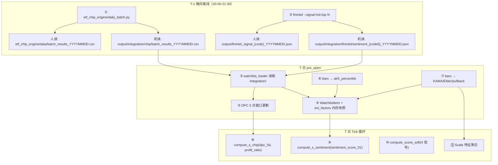

# 外部数据集成方案（最终合并版 v2）

> 合并优化版架构 + 原方案 Scale 公式 + 审阅修正（SENTIMENT_JSON 前缀、ext_factors 主路径、D+LOW 触发修正、kama 别名、命名统一）

---

## 一、总体架构



> [!IMPORTANT]
> 约束：业务层通过适配器/文件读取，不直接依赖 xtdata/xttrader，保持可切换性。交易系统只依赖 `output/integration/` 目录。

---

## 二、夜间产出（T-1 晚）

### 2.1 筹码/微观（已实装）

```powershell
python etf_chip_engine/daily_batch.py --date auto
```

[daily_batch.py](file:///d:/Quantitative_Trading/etf_chip_engine/daily_batch.py#L165-L180) 已实现双输出：

| 输出 | 路径 | 备注 |
|:---|:---|:---|
| 人读 | `etf_chip_engine/data/batch_results_YYYYMMDD.csv` | 原始 dense_zones repr |
| 机读 | `output/integration/chip/batch_results_YYYYMMDD.csv` | 稳定派生列 |

机读 CSV 关键列：

| 列名 | 类型 | 用途 |
|:---|:---|:---|
| `code` | str | ETF 代码 |
| `trade_date` | str | 交易日 |
| `profit_ratio` | float | 0-100，S_chip 门控 + Watchlist |
| `dpc_peak_density` | float | **DPC 峰值密度**（`max(z.density)` from dense_zones）|
| `support_price_max_density` | float? | 最大密度支撑位 |
| `resistance_price_max_density` | float? | 最大密度阻力位 |
| `ms_vpin_rank` | float? | VPIN 截面分位 0-1 |
| `ms_ofi_daily_z` | float? | OFI Z-score |
| `ms_vs_max_logz` | float? | Volume Surprise logZ |
| `chip_engine_days` | int | 冷启动天数 |
| `dense_zones_json` | str | 稳定 JSON（扩展用）|

---

### 2.2 情绪因子（DeepSeek）

```powershell
python -m finintel --signal-hot-top 15
```

#### Prompt（已实装）

[prompts.py L202-211](file:///d:/Quantitative_Trading/finintel/prompts.py#L202-L211) 已包含结构化输出要求：

```
## 结构化输出（必须遵守）
最后一行必须输出一段 JSON，且必须以 `SENTIMENT_JSON:` 作为前缀（单行，不要代码块）：
SENTIMENT_JSON: {"sentiment_grade":"A|B|C|D|E","confidence":"HIGH|MEDIUM|LOW"}
```

[etf_signal_pipeline.py L1451](file:///d:/Quantitative_Trading/finintel/etf_signal_pipeline.py#L1451) 用正则 `SENTIMENT_JSON:\s*(\{[^\n\r]*\})` 解析该行。

> [!CAUTION]
> 所有文档/代码必须使用 `SENTIMENT_JSON:` 前缀格式，不可写成裸 JSON 块，否则解析器无法匹配。

#### 机读输出：`output/integration/finintel/sentiment_{code6}_YYYYMMDD.json`

| 字段 | 类型 | 用途 |
|:---|:---|:---|
| `sentiment_grade` | str | A/B/C/D/E |
| `confidence` | str | HIGH/MEDIUM/LOW |
| `sentiment_score_01` | float | **0-1**，直传 `compute_s_sentiment()` |
| `sentiment_score_100` | int | **0-100**，传 `WatchlistItem.sentiment_score` |

#### 映射逻辑（finintel 侧产出时计算）

```python
GRADE_MAP_01 = {"A": 0.90, "B": 0.65, "C": 0.50, "D": 0.25, "E": 0.10}
GRADE_MAP_100 = {"A": 85, "B": 70, "C": 50, "D": 30, "E": 15}

def map_sentiment(grade: str, confidence: str) -> tuple[float, int]:
    s01 = GRADE_MAP_01.get(grade.upper(), 0.50)
    if confidence.upper() == "LOW":
        s01 = (s01 + 0.50) / 2  # 低置信度向中性收敛
    s100 = GRADE_MAP_100.get(grade.upper(), 50)
    return round(s01, 4), int(s100)
```

> [!NOTE]
> `S_SENTIMENT_THRESHOLD = 0.35`（0-1 刻度）。触发规则：
> - E=0.10 → **必触发**（HIGH/MEDIUM/LOW 均 ≤ 0.35）
> - D=0.25 → HIGH/MEDIUM 触发；**LOW 时 (0.25+0.5)/2=0.375 > 0.35，不触发**（保守降噪）
> - A/B/C → 不触发

---

## 三、次日接线（T 日 pre_open）

### 3.1 模块清单

| 文件 | 职责 |
|:---|:---|
| `[NEW] integrations/watchlist_loader.py` | 读取 integration/ → WatchlistItem + ext_factors |
| `[NEW] integrations/chip_history.py` | DPC 5 日窗口持久化 |
| `[NEW] integrations/scale_features.py` | 加仓特征聚合（KAMA/Elder/pullback/chip/micro）|
| `[MODIFY] strategy_runner.py` | 替换所有占位值 |
| `[MODIFY] entry/signals/trend.py` | `_kama()` / `_ema()` → 公共函数（去掉 `_` 前缀）|
| `[MODIFY] finintel/prompts.py` | 追加 §3.5 结构化评级 |

---

### 3.2 WatchlistItem 构造

#### 改造：`StrategyRunner._build_watchlist()` [L214-218](file:///d:/Quantitative_Trading/strategy_runner.py#L214-L218)

外部因子存储策略（**主路径：`ext_factors` 内存快照**）：

- **主路径**：Runner 维护 `self._ext_factors: dict[str, dict]` 内存快照（per ETF），所有 tick 循环中的外部因子读取**统一从此处取**
- **辅助**：`WatchlistItem.sentiment_score` = `sentiment_score_100`（int, 0-100，入场过滤用）
- **不使用**：`WatchlistItem.extra` 仅作兜底，正常流程不依赖

> [!WARNING]
> [PositionState](file:///d:/Quantitative_Trading/core/models.py#L272-L298) 没有 `extra` 字段。外部因子**禁止**写入 PositionState。

> [!IMPORTANT]
> 出场/加仓读取外部因子的唯一路径：`self._ext_factors[etf_code]["sentiment_score_01"]`。不从 `WatchlistItem.extra` 取，避免实现人员各写各的。

字段映射（文件名统一用 `{code6}`，如 `159242`；文件内容用 `etf_code_norm`，如 `159242.SZ`）：

| WatchlistItem 字段 | 数据来源 | 缺失回退 |
|:---|:---|:---|
| `sentiment_score` | sentiment JSON `sentiment_score_100` | 50 |
| `profit_ratio` | chip CSV `profit_ratio` | 0.0 |
| `nearest_resistance` | chip CSV `resistance_price_max_density` | None |
| `vpin_rank` | chip CSV `ms_vpin_rank` | None |
| `ofi_daily` | chip CSV `ms_ofi_daily_z` | None |
| `vs_max` | chip CSV `ms_vs_max_logz` | None |
| `micro_caution` | `vpin_rank > 0.70 or ofi_daily < 0` | False |

`ext_factors[etf_code]` 内存快照：

| 键 | 来源 | 缺失回退 |
|:---|:---|:---|
| `sentiment_score_01` | sentiment JSON | 0.5 |
| `profit_ratio` | chip CSV | 0.0 |
| `dpc_peak_density` | chip CSV | 0.0 |
| `dense_zones_json` | **integration** chip CSV | `"[]"` |
| `support_price_max_density` | chip CSV | None |
| `ms_vs_max_logz` | chip CSV | None |
| `chip_engine_days` | chip CSV | 0 |
| `extra.sentiment_score_01` | sentiment JSON `sentiment_score_01` | 0.5 |

---

### 3.3 DPC 5 日窗口

> `dpc_window` ≠ `profit_ratio`。`dpc_peak_density` 已由 daily_batch.py 预计算。

`chip_history.py` — 每 ETF 持久化最近 10 天 DPC 值：

```python
class ChipDPCHistory:
    def append(self, etf_code: str, dpc_value: float) -> list[float]: ...
    def get_5d(self, etf_code: str) -> Optional[list[float]]:
        """返回最近 5 天 dpc_peak_density，不足 5 天返回 None。"""
```

接入：
- `_pre_open()`：读取 chip CSV `dpc_peak_density` → `self._dpc_history.append(code, dpc)`
- Tick 循环：`dpc_5d = self._dpc_history.get_5d(code)` → `compute_s_chip(dpc_5d, profit_ratio)`
- 冷启动：`chip_engine_days < 10` 或 `dpc_5d is None` → `S_chip = 0.0`

---

### 3.4 atr5_percentile

替换 [L258](file:///d:/Quantitative_Trading/strategy_runner.py#L258) 的 `atr5_percentile=0.5`：

```python
def _compute_atr5_percentile(self, etf_code: str) -> float:
    bars = self._data.get_bars(etf_code, "1d", 125)
    if len(bars) < 10:
        return 50.0
    # 计算 TR 序列
    closes = [float(b.close) for b in bars]
    highs = [float(b.high) for b in bars]
    lows = [float(b.low) for b in bars]
    trs = [max(highs[i]-lows[i], abs(highs[i]-closes[i-1]), abs(lows[i]-closes[i-1]))
           for i in range(1, len(bars))]
    if len(trs) < 5:
        return 50.0
    # 滚动 ATR(5) → 分位数
    atr5s = [sum(trs[i-4:i+1])/5.0 for i in range(4, len(trs))]
    current = atr5s[-1]
    rank = sum(1 for x in atr5s if x <= current) / len(atr5s)
    return round(100.0 * rank, 1)
```

> 输出 0-100，与 `ATR5_PERCENTILE_THRESHOLD = 65.0` 对齐。

---

### 3.5 KAMA / Elder 复用（Scale 趋势门控）

#### 关键约束

```python
# position/scale_signal.py L25
trend_ok = (kama_rising_days >= 2) and elder_impulse_green
```

**两者全为 0/False 时加仓永远不通过**。

#### `entry/signals/trend.py` — 添加公共别名（不改原函数）

保留 `_kama` / `_ema` 不动，在文件末尾添加别名导出：

```python
# 公共别名，供 integrations/scale_features.py 复用
kama = _kama
ema = _ema
```

> [!TIP]
> 比直接改名更安全：不影响 `compute_trend()` 等现有调用者，也不影响任何可能引用 `_kama` 的测试。

#### `scale_features.py` 中复用

```python
from entry.signals.trend import kama, ema

def compute_kama_rising_days(closes: list[float], period: int = 10) -> int:
    """KAMA 连续上行天数。"""
    kama_vals = kama(closes, period)
    if len(kama_vals) < 2:
        return 0
    days = 0
    for i in range(len(kama_vals) - 1, 0, -1):
        if kama_vals[i] > kama_vals[i - 1]:
            days += 1
        else:
            break
    return days

def compute_elder_impulse_green(closes: list[float]) -> bool:
    """Elder Impulse = EMA13 上行 AND MACD-H 上行。"""
    if len(closes) < 30:
        return False
    ema13 = ema(closes, 13)
    ema13_rising = ema13[-1] > ema13[-2]
    ema12 = ema(closes, 12)
    ema26 = ema(closes, 26)
    macd_line = [a - b for a, b in zip(ema12, ema26)]
    signal = ema(macd_line, 9)
    hist = [m - s for m, s in zip(macd_line, signal)]
    return bool(ema13_rising and hist[-1] > hist[-2])
```

---

### 3.6 Scale 特征聚合（完整公式）

替换 `_evaluate_scale_placeholder()` [L585-616](file:///d:/Quantitative_Trading/strategy_runner.py#L585-L616) 的全部占位值：

| 参数 | 公式 | 数据来源 | 缺失回退 |
|:---|:---|:---|:---|
| `unrealized_profit_atr14_multiple` | `(last_price - avg_cost) / ATR14` | snapshot + bars | 0.0 |
| `score_soft` | `compute_score_soft({S_chip, S_sentiment, S_diverge, S_time}).score_soft` | 同 Layer2 管道 | 0.5 |
| `kama_rising_days` | §3.5 `compute_kama_rising_days(closes)` | 日线 bars (≥30) | 0 |
| `elder_impulse_green` | §3.5 `compute_elder_impulse_green(closes)` | 日线 bars (≥30) | False |
| `pullback_atr14_multiple` | `(ps.highest_high - last_price) / ATR14` | PositionState + bars | 0.0 |
| `chip_density_rank` | 见下方 | dense_zones_json | 0.0 |
| `chip_touch_distance_atr14` | 见下方 | dense_zones_json + ATR14 | 0.0 |
| `micro_vol_ratio` | `clamp(ms_vs_max_logz / 3.0, 0, 1)` | chip CSV | 0.0 |
| `micro_support_held` | `last_price >= support_price - 2 * tick` | chip CSV `support_price_max_density` | False |
| `micro_bullish_close` | `last_price > VWAP AND kama_rising_days >= 1` | snapshot + bars | False |
| `above_chandelier_stop` | `last_price > stop_price`（已有）| — | — |

#### chip_density_rank + chip_touch_distance_atr14

> [!IMPORTANT]
> `dense_zones_json` **必须**来自 `output/integration/chip/batch_results_*.csv` 的 `dense_zones_json` 列（已由 daily_batch.py 做过 JSON 标准化）。**禁止**读取人读版 `dense_zones` 列（可能是 Python repr 格式，无法 `json.loads`）。

```python
def chip_zone_features(
    dense_zones_json: str, last_price: float, atr14: float
) -> tuple[float, float]:
    """返回 (density_rank, touch_distance_atr14)。
    dense_zones_json 必须来自 integration CSV 的 dense_zones_json 列。
    """
    zones = json.loads(dense_zones_json or "[]")
    if not zones or atr14 <= 0:
        return 0.0, 0.0
    # 按距离找最近密集区
    zones_sorted = sorted(zones, key=lambda z: abs(float(z["price"]) - last_price))
    nearest = zones_sorted[0]
    distance = abs(float(nearest["price"]) - last_price) / atr14
    # 最近区 density 的百分位排名
    densities = sorted(float(z["density"]) for z in zones)
    nd = float(nearest["density"])
    rank = sum(1 for d in densities if d <= nd) / len(densities)
    return round(rank, 4), round(distance, 4)
```

---

### 3.7 Layer2 评分完整接入

替换 [L458-470](file:///d:/Quantitative_Trading/strategy_runner.py#L458-L470)：

```python
ext = self._ext_factors.get(etf_code, {})  # 唯一读取路径
signals: dict[str, float] = {"S_diverge": s_diverge, "S_time": s_time}

# S_chip（从 DPC 窗口 + profit_ratio）
dpc_5d = self._dpc_history.get_5d(etf_code)
pr = float(ext.get("profit_ratio", 0.0))
chip_days = int(ext.get("chip_engine_days", 0))
if dpc_5d is not None and len(dpc_5d) >= 5 and chip_days >= 10:
    signals["S_chip"] = compute_s_chip(dpc_5d, pr)

# S_sentiment（从 ext_factors 内存快照，不从 WatchlistItem.extra 取）
sent_01 = float(ext.get("sentiment_score_01", 0.5))
signals["S_sentiment"] = compute_s_sentiment(sent_01)

score_soft_layer2 = compute_score_soft(signals).score_soft
```

> 权重：S_chip=0.7, S_sentiment=0.7, S_diverge=0.5, S_time=0.4（满分 2.3，阈值 0.9）

---

## 四、数据合同

### 4.1 口径统一

| 字段 | 范围 | 约束 |
|:---|:---|:---|
| `atr5_percentile` | 0-100 | 阈值 65.0 |
| `sentiment_score_01` | 0-1 | 阈值 0.35 |
| `sentiment_score_100` | 0-100 | Watchlist 入场 |
| `dpc_window` | density 序列 | 来自 `dpc_peak_density`，非 profit_ratio |
| `profit_ratio` | 0-100 (%) | S_chip 门控 < 75 |
| `vpin_rank` | 0-1 | 截面分位 |
| `micro_vol_ratio` | 0-1 | logz/3 截断 |

### 4.2 缺失回退

| 数据 | 缺失值 | 效果 |
|:---|:---|:---|
| sentiment JSON | 0.5 / 50 | 中性不触发 |
| chip CSV | profit_ratio=0, dpc=0 | S_chip 门控不通过 |
| dpc_window < 5 天 | S_chip=0.0 | 冷启动禁用 |
| chip_engine_days < 10 | S_chip=0.0 | 冷启动禁用 |
| bars < 30 | KAMA=0, Elder=False | Scale 趋势门控不通过 |

### 4.3 文件查找

- 取 **严格 < T 日** 的最新结果
- chip: `output/integration/chip/batch_results_YYYYMMDD.csv`
- sentiment: `output/integration/finintel/sentiment_{code6}_YYYYMMDD.json`
- 解析错误 → 降级 + `logger.warning`，不阻断主流程

---

## 五、夜间调度

```powershell
$ErrorActionPreference = "Stop"

Write-Host "=== Step 1: Chip engine batch ==="
python etf_chip_engine/daily_batch.py --date auto

Write-Host "=== Step 2: Finintel sentiment ==="
python -m finintel --signal-hot-top 15

Write-Host "=== Done ==="
```

---

## 六、代码变更清单

文件名约定：文件路径中 ETF 代码统一用 **6 位纯数字**（`{code6}`，如 `159242`），文件内容中用完整代码（`159242.SZ`）。

| 文件 | 类型 | 改动 |
|:---|:---|:---|
| `integrations/watchlist_loader.py` | NEW | 读取 integration/ → WatchlistItem + ext_factors |
| `integrations/chip_history.py` | NEW | DPC 5 日窗口持久化 |
| `integrations/scale_features.py` | NEW | KAMA/Elder/pullback/chip/micro 聚合 |
| `strategy_runner.py` | MODIFY | 4 处替换（watchlist/atr5/layer2/scale）|
| `entry/signals/trend.py` | MODIFY | 添加 `kama = _kama` / `ema = _ema` 公共别名 |
| `finintel/prompts.py` | — | 已实装（`SENTIMENT_JSON:` 前缀，无需改动）|
