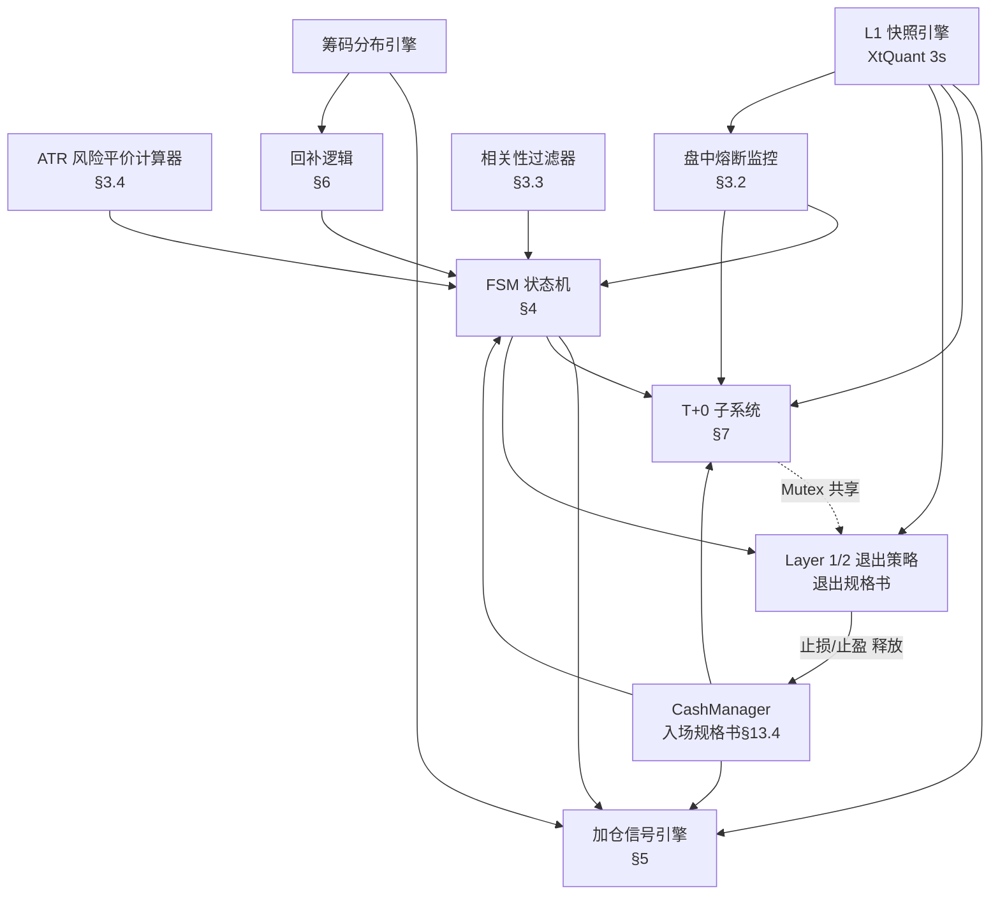

# ETF 仓位管理策略 — 实现验证套件 v1.1

> **用途**：编码时与 `position_management_specification.md` v2.1 配对使用。  
> 本文档包含编码合约、验收场景、断言清单、日志规范和模块依赖图。  
> 目标：让 AI 误读规格书导致的沉默逻辑错误在上线前被发现。

---

## Part 1：编码合约（MUST / MUST NOT）

> [!CAUTION]
> 以下每一条都是**硬约束**。违反任何一条都可能导致策略从盈利变为亏损。

### 1.1 ATR 风险平价仓位计算（§3.4）

```
✅ MUST: effective_slot 公式为：
  effective_slot = min(
      risk_budget / (max(ATR_pct, 0.015) * stop_multiplier),
      70000
  )

✅ MUST: risk_budget = clamp(current_nav * 0.02, 2500, 6000)
  每次触发入场/加仓决策时用当前净值实时计算。

✅ MUST: stop_multiplier = 3.5（固定值，≥ 实际 k=3.0 + 滑点余量）

✅ MUST: ATR_pct = ATR_20 / Price（使用信号触发日 T-1 收盘数据）

✅ MUST: 所有金额通过 effective_slot 联动计算：
  base_target = effective_slot * 0.71
  scale_1_amt = effective_slot * 0.19
  scale_2_amt = effective_slot * 0.10
  trial_amt   = base_target * 0.30（普通）或 base_target * 0.50（强信号）
  confirm_amt = base_target - trial_amt

❌ MUST NOT: stop_multiplier 不得小于 3.0。
  （v2.0 的 2.5 是方向性错误，使仓位偏大 20%。越小仓位越大，越激进。）
❌ MUST NOT: risk_budget 不得硬编码为 4000。必须动态追踪 current_nav。
❌ MUST NOT: 不得将 ATR_14 和 ATR_20 混用。定仓用 ATR_20，加仓前提用 ATR_14。
```

### 1.2 FSM 状态跃迁（§4）

```
✅ MUST: FSM 仅有 6 个合法状态：
  S0:IDLE, S1:TRIAL, S2:BASE, S3:SCALED, S4:FULL, S5:REDUCED

✅ MUST: 合法跃迁路径（仅以下 11 条，其余全为非法）：
  S0→S1（入场信号触发）
  S1→S2（Phase 3 确认成立）
  S1→S0（失效/被抢占）
  S2→S3（加仓 #1 成交）
  S2→S5（Layer 2 减仓）
  S2→S0（Layer 1 止损）
  S3→S4（加仓 #2 成交）
  S3→S5（Layer 2 减仓）
  S3→S0（Layer 1 止损）
  S4→S5（Layer 2 减仓）
  S4→S0（Layer 1 止损）
  S5→S0（Layer 1 止损）
  S5→S4（回补重建，最多 1 次）

✅ MUST: 任何状态跃迁前，写入新状态到 state.json 后再执行交易。
✅ MUST: 跃迁到 S0 时，清除该 ETF 的可安全清除的状态：
  清除：T+0 本地状态、当日未成交买单、无效 scale_pending
  保留：pending_sell_locked（T+1 锁定强平）、pending_sell_unfilled（熔断/跌停未成交卖出）

❌ MUST NOT: 不得出现 S1→S3（跳过底仓确认直接加仓）。
❌ MUST NOT: 不得出现 S5→S3（从减仓到加仓第一阶段）。回补只能到 S4:FULL。
❌ MUST NOT: 不得在 S4 状态接受任何加仓信号。S4=满仓，拒绝一切加仓。
```

### 1.3 加仓信号判定（§5）

```
✅ MUST: 加仓前提条件全部 6 项同时满足（AND 关系）：
  a) 当前状态 ∈ {S2, S3}
  b) 浮盈 ≥ 1.5 × ATR_14
  c) 熔断未触发
  d) Score_soft < 0.5
  e) 距上次加仓 ≥ 3 个交易日
  f) 加仓后总仓位 ≤ effective_slot

✅ MUST: 加仓信号四条件共振（AND 关系）：
  1) KAMA(10) 连续上升 ≥ 2 日 AND Elder Impulse = Green
  2) 回调 ≥ 1.0 × ATR_14 且未破 Chandelier Stop
  3) 筹码支撑区确认（density 前 30%，价格触及支撑区上沿 ± 0.3×ATR_14）
  4) 微观止跌确认：30min 缩量 30%+ AND 未破支撑 AND 止跌企稳阳线

✅ MUST: 加仓挂单价 = tick_ceil(Bid1)（左侧限价，不追涨）
✅ MUST: 加仓挂单当日收盘自动撤单，不隔夜。

❌ MUST NOT: 加仓不得使用 Ask1（不追涨，只接盘）。
❌ MUST NOT: 不得在 Score_soft ≥ 0.5 时加仓（安全阀硬约束）。
❌ MUST NOT: 加仓未成交时不写 pending，次日必须重新评估全部 6 项前提。
```

### 1.4 账户级熔断器（§3.2，v2.1 更新）

```
✅ MUST: 盘中软熔断（每 3 秒快照检查）：
  nav_estimate = 持仓市值 + 可用现金
  IF nav_estimate ≤ HWM × 0.92 → 冻结所有新开仓（试探/加仓/做T买入）
  IF nav_estimate ≤ HWM × 0.90 → 清仓（调用 Layer 1 卖出执行器）

✅ MUST: 盘后硬熔断（15:30 检查）：
  current_nav ≤ HWM × 0.90 → 全清 + 5 日冷静期

✅ MUST: HWM 必须单调递增：HWM = max(HWM, current_nav)
✅ MUST: 熔断清仓调用退出策略的 Layer 1 执行器（含跌停排队/pending/降级）
✅ MUST: 冷静期解锁需同时满足：≥ 5 日 AND 大盘站上 20 日均线 AND 人工 ACK

❌ MUST NOT: HWM 任何时候不可被下调（不允许"重置净值"操作）。
❌ MUST NOT: 冻结新开仓时不得冻结止损/减仓/卖出操作（只冻结买入方向）。
❌ MUST NOT: 熔断清仓不得另写简化版卖出逻辑，必须复用退出策略执行器。
❌ MUST NOT: 盘中熔断触发后，即使 V 反转致收盘 nav > HWM×0.90，也不得撤销冷静期。
❌ MUST NOT: “不可撤销”不得被误读为“不可重试卖出”。pending_sell_unfilled 必须当日持续重试。
```

### 1.5 T+0 联动（§7）

```
✅ MUST: T+0 状态完全由 Layer B FSM 驱动：
  S0/S1/S5 → T+0 OFF
  S2/S3/S4 → T+0 ON（附加条件：浮盈>1% AND 日亏<0.3%）

✅ MUST: T+0 额度上限 = min(底仓市值×20%, 可用Reserve)
  （v2.1 修正：删除原第三项 Slot上限-底仓。原因：正T 买入用 Reserve，不占 Slot）

✅ MUST: T+0 方向决策使用 VWAP σ带：
  price > vwap + 1.5σ → 反T（先卖后买）
  price < vwap - 1.5σ → 正T（先买后卖）
  其他 → 不做T

✅ MUST: 极端行情冻结：
  日涨幅 > 6% → 冻结反T（逼近涨停）
  日跌幅 > 5% → 冻结正T（跌停死锁风险）

✅ MUST: 正T 的 locked_qty（T+1 不可卖）如遇止损，写入 pending_sell_locked，
  次日 09:30 连续竞价跌停价挂单强平（v1.2 同步 T0 规格书）。

❌ MUST NOT: T+0 不得在 S5:REDUCED 状态激活（趋势可能终结）。
❌ MUST NOT: T+0 买入不得使用 Slot 的锁定金，只能用 Reserve。
❌ MUST NOT: T+0 VWAP 计算不得包含 09:30 前的集合竞价数据。
```

### 1.6 T+0 竞态 Mutex（§7.7）

```
✅ MUST: T+0 与 Layer 1/2 共享互斥锁，任何时刻仅一个模块可提交订单。

✅ MUST: 场景 1（正T+止损）：
  → Layer 1 立即执行（Priority 0）
  → 正T locked_qty 写入 pending_sell_locked，次日强平

✅ MUST: 场景 2（反T+止损）：
  → 撤销反T 的接回买单
  → Layer 1 清空剩余 sellable_qty
  → 标记为良性异常（反T客观上已减少暴露）

✅ MUST: 场景 3（T+0 传输中+Layer 2）：
  → Layer 2 进入 WAIT 队列，最长等 10 秒
  → 超时后强制执行 Layer 2，T+0 结果纳入计算

❌ MUST NOT: Layer 1 止损信号不得因等待 T+0 锁而被延迟超过 2 秒。
❌ MUST NOT: Mutex 持锁时间不得超过 2 秒（锁只保护"写状态+提交"瞬间）。
```

### 1.7 减仓与回补（§4, §6）

```
✅ MUST: Layer 2 减仓一律 50%（基于 total_qty，不区分底仓/加仓）
✅ MUST: 减仓后跃迁到 S5，T+0 立即冻结，已有 T+0 挂单立即撤单
✅ MUST: S5 状态下止损线收紧至 k=1.5（保命模式）

✅ MUST: 回补条件全部 6 项 AND 关系：
  a) 减仓后 ≥ 5 日冷却
  b) 新筹码密集区形成（≥ 5 日，density 前 20%）
  c) 压力测试未破位
  d) 放量突破（vol_ratio ≥ 1.5）
  e) Score_soft = 0
  f) LLM 情绪 > 50

✅ MUST: 回补视为全新建仓 — 重新计算 ATR、止损线，不沿用旧参数
✅ MUST: 回补最多 1 次/波段。第二次 Layer 2 触发 → 直接走 S5→S0

❌ MUST NOT: 不得在 Score_soft ≥ 0.5 时执行回补。
❌ MUST NOT: 回补不得在原价位无脑加回（必须有新密集区支撑）。
```

### 1.8 相关性过滤（§3.3）

```
✅ MUST: 开仓前检查新标的与现有持仓的 Pearson 相关性：
  ρ ≥ 0.60 → 互斥，禁止同时建仓

✅ MUST: 计算窗口 = 过去 20 个交易日收盘价
✅ MUST: 如果已有 2 只持仓且 ρ < 0.60，仍不能新开仓（没有空 Slot）

❌ MUST NOT: 不得将相关性阈值硬编码低于 0.60。
❌ MUST NOT: 1 只持仓时无需做相关性检查（无对象可比较），但仍受 Slot 数限制。
```

---

## Part 2：验收场景（27 个关键场景）

> [!IMPORTANT]
> 每个场景有明确输入和预期输出。全部通过才可进入影子模式。

### ATR 风险平价验收

| # | 场景 | 输入 | 预期结果 |
|:---:|:---|:---|:---|
| 1 | 高波标的定仓 | NAV=200k, ATR_pct=3.58%, stop_mult=3.5 | risk_budget=4000, effective_slot=31,923, base=22,665 |
| 2 | 低波标的触顶 | NAV=200k, ATR_pct=1.25%→强制1.5% | effective_slot=76,190→截断70,000, base=49,700 |
| 3 | 亏损后预算缩减 | NAV=150k | risk_budget=3000, 半导体 slot=3000/(0.0358×3.5)=23,943 |
| 4 | 重大亏损下限 | NAV=100k | risk_budget=clamp(2000, 2500, 6000)=2500 |
| 5 | 盈利后上限 | NAV=350k | risk_budget=clamp(7000, 2500, 6000)=6000 |
| 6 | stop_mult 方向验证 | 比较 mult=2.5 vs 3.5（ATR=3.58%） | 2.5→44,692（偏大！）, 3.5→31,923√ |

### FSM 跃迁验收

| # | 场景 | 输入 | 预期结果 |
|:---:|:---|:---|:---|
| 7 | 正常全生命周期 | 入场→加仓×2→Layer2→Layer1 | S0→S1→S2→S3→S4→S5→S0 |
| 8 | 试探失效 | S1窗口到期, Close < L_signal | S1→S0, T+0=OFF（本来就OFF） |
| 9 | 非法跃迁拦截 | S1 状态尝试加仓 | 拒绝，保持 S1 |
| 10 | S4 拒绝加仓 | S4:FULL 状态收到加仓信号 | 拒绝加仓（已满仓），保持 S4 |
| 11 | S5 回补后二次 L2 | S5→S4→S5（第二次L2） | 第二次直接走 S5→S0，不允许再回补 |

### 加仓信号验收

| # | 场景 | 输入 | 预期结果 |
|:---:|:---|:---|:---|
| 12 | 前提不满足-浮盈不足 | S2状态, 浮盈=1.0×ATR_14 | 不评估加仓信号（前提b不满足） |
| 13 | 前提不满足-安全阀 | S2状态, Score_soft=0.55 | 不评估加仓信号（前提d不满足） |
| 14 | 前提不满足-间隔不足 | S2状态, 上次加仓2天前 | 不评估加仓信号（前提e不满足） |
| 15 | 四条件缺一 | 趋势✅ 回调✅ 筹码✅ 缩量❌ | 不触发加仓 |
| 16 | 正常加仓 | 6 前提✅ + 4 条件✅ | 挂 Bid1 限价买单，收盘自动撤 |

### T+0 联动验收

| # | 场景 | 输入 | 预期结果 |
|:---:|:---|:---|:---|
| 17 | S2激活T+0 | S2:BASE, 浮盈1.5%, 日亏0% | T+0=ON, 额度=min(5万×20%, Reserve) |
| 18 | S5冻结T+0 | Layer 2 触发减仓 | T+0立即OFF, 撤销所有T+0挂单 |
| 19 | 极端行情冻结 | 日涨幅+7%, price > vwap+1.5σ | 冻结反T（HOLD），日志记录原因 |
| 20 | 正T+止损竞态 | 正T成交1万 → 5秒后止损触发 | Layer 1 清空sellable, locked_qty写pending, 次日强平 |
| 21 | 反T+止损竞态 | 反T卖出后 → 止损触发 | 撤接回买单, Layer 1 清剩余, 标良性异常 |

### 熔断器验收

| # | 场景 | 输入 | 预期结果 |
|:---:|:---|:---|:---|
| 22 | 盘中预警 | HWM=200k, nav_estimate=183k | 183k ≤ 200k×0.92=184k → 冻结新开仓 |
| 23 | 盘中硬熔断 | HWM=200k, nav_estimate=179k | 179k ≤ 200k×0.90=180k → 按Layer1清仓 |
| 24 | 冷静期未满解锁 | 熔断3天, 大盘>MA20, 人工ACK | 拒绝解锁（3<5天） |
| 25 | 相关性互斥 | 持有512480, 新标的588000, ρ=0.72 | 禁止建仓（ρ≥0.60） |

### 边界场景验收（v1.1 R2 新增）

| # | 场景 | 输入 | 预期结果 |
|:---:|:---|:---|:---|
| 26 | T+0 闭环超时 | 正T买入 14:55, 未能在 15:00 前卖出 | locked_qty 写入 pending, 次日 09:30 连续竞价跌停价强平, T+0 自动冻结 |
| 27 | 回补中途条件变化 | S5 回补挂单已提交未成交, Score_soft 从 0→0.6 | 立即撤单, 保持 S5, 日志记录「回补条件失效，已撤单」 |

---

## Part 3：运行时断言清单

以下断言必须嵌入代码中，运行时违反则立即报警并阻止执行。

```python
# ===== ATR 风险平价 =====
assert stop_multiplier >= 3.0, \
    f"stop_multiplier={stop_multiplier} < 3.0，方向性错误！值越小仓位越大"

risk_budget = max(2500, min(current_nav * 0.02, 6000))
assert 2500 <= risk_budget <= 6000, \
    f"risk_budget={risk_budget} 越界"

assert effective_slot <= 70000, \
    f"effective_slot={effective_slot} 超过7万硬上限"

assert ATR_pct >= 0.015 or ATR_pct_raw < 0.015, \
    f"ATR_pct 下限保护未生效: raw={ATR_pct_raw}"

# ===== FSM 跃迁合法性 =====
LEGAL_TRANSITIONS = {
    "S0": ["S1"],
    "S1": ["S2", "S0"],
    "S2": ["S3", "S5", "S0"],
    "S3": ["S4", "S5", "S0"],
    "S4": ["S5", "S0"],
    "S5": ["S0", "S4"],  # S4 仅限回补
}
assert new_state in LEGAL_TRANSITIONS.get(current_state, []), \
    f"非法跃迁: {current_state}→{new_state}"

# ===== 加仓前提 =====
if action == "SCALE_BUY":
    assert current_state in ("S2", "S3"), \
        f"加仓状态非法: {current_state}"
    assert unrealized_pnl >= 1.5 * ATR_14, \
        f"浮盈 {unrealized_pnl:.0f} < 1.5×ATR_14={1.5*ATR_14:.0f}"
    assert score_soft < 0.5, \
        f"安全阀: Score_soft={score_soft} ≥ 0.5，禁止加仓"
    assert days_since_last_scale >= 3, \
        f"加仓间隔仅 {days_since_last_scale} 天 < 3 天"
    assert projected_total <= effective_slot, \
        f"加仓后 {projected_total} > effective_slot {effective_slot}"

# ===== T+0 状态联动 =====
if position_state in ("S0", "S1", "S5"):
    assert t0_enabled == False, \
        f"T+0 在 {position_state} 不应激活"

if position_state in ("S2", "S3", "S4") and t0_enabled:
    assert current_return > 0.01, \
        f"T+0 激活但浮盈={current_return:.2%} ≤ 1%"
    assert daily_t0_loss < 0.003, \
        f"T+0 日亏={daily_t0_loss:.3%} ≥ 0.3% 熔断线"

# ===== T+0 额度（v2.1 修正：删除原第三项） =====
max_t0 = min(
    current_base_value * 0.20,
    cash_manager.available_reserve()
)
assert t0_exposure <= max_t0, \
    f"T+0 暴露 {t0_exposure} > 上限 {max_t0}"

# ===== 熔断器 =====
assert hwm >= prev_hwm, \
    f"HWM 被下调: {hwm} < {prev_hwm}，违反单调递增"

if nav_estimate <= hwm * 0.92:
    assert new_buy_blocked == True, \
        "盘中预警未冻结新开仓"

if nav_estimate <= hwm * 0.90:
    assert clearing_in_progress == True, \
        "盘中熔断未触发清仓"
    assert intraday_breaker_irrevocable == True, \
        "盘中熔断触发后必须标记为不可撤销"

# ===== 减仓比例 =====
if action == "LAYER2_REDUCE":
    expected_sell = total_qty // 2  # 50% 取整
    assert abs(actual_sell_qty - expected_sell) <= 100, \
        f"减仓量 {actual_sell_qty} ≠ 50%={expected_sell}"

# ===== 回补限制 =====
if action == "REBUILD" and current_state == "S5":
    assert rebuild_count_this_wave == 0, \
        f"回补次数={rebuild_count_this_wave}，本波段已用完回补机会"
    assert score_soft == 0, \
        f"回补时 Score_soft={score_soft} ≠ 0"

# ===== 相关性互斥 =====
for held in current_holdings:
    if held.etf_code != new_etf_code:
        corr = pearson_correlation(held.etf_code, new_etf_code, window=20)
        assert corr < 0.60, \
            f"相关性 ρ({held.etf_code},{new_etf_code})={corr:.2f} ≥ 0.60 互斥"

# ===== Mutex 超时 =====
if mutex_held:
    assert mutex_hold_duration < 2.0, \
        f"Mutex 持锁 {mutex_hold_duration:.1f}s > 2s 上限"

# ===== pending 重试安全检查 =====
if pending_retry_action == "SCALE_BUY":
    assert current_state in ("S2", "S3"), \
        f"pending 重试时 FSM={current_state}，已不再允许加仓，取消 pending"
    assert not circuit_breaker.triggered, \
        "pending 重试时熔断器已触发，禁止买入"
    assert not intraday_freeze, \
        "pending 重试时盘中冻结生效中，禁止买入"
    assert len(current_holdings) < 2 or current_state in ("S2", "S3"), \
        "pending 重试时无空 Slot"

# ===== 数据口径校验 =====
if action in ("ENTRY", "SCALE_BUY", "REBUILD"):
    assert atr_window_used == 20, \
        f"定仓/加仓/回补必须使用 ATR_20，实际使用 ATR_{atr_window_used}"
    assert atr_price_date == signal_date - timedelta(days=1), \
        f"ATR 应用 T-1 收盘价，实际用了 {atr_price_date}"

if action == "SCALE_CHECK_PREREQ":
    assert unrealized_pnl_atr_window == 14, \
        f"加仓前提浮盈检查必须用 ATR_14，实际用了 ATR_{unrealized_pnl_atr_window}"

# ===== 订单行为校验 =====
if action == "SCALE_BUY" and order_submitted:
    assert order_price == tick_ceil(bid1_price), \
        f"加仓挂单价应为 tick_ceil(Bid1)={tick_ceil(bid1_price)}，实际={order_price}"
    assert order_tif == "DAY", \
        f"加仓挂单必须当日有效，实际 TIF={order_tif}"

# ===== 冷静期解锁条件 =====
if action == "UNLOCK_COOLDOWN":
    assert cooldown_days >= 5, \
        f"冷静期仅 {cooldown_days} 天 < 5 天"
    assert market_above_ma20 == True, \
        "大盘未站上 20 日均线，禁止解锁"
    assert manual_ack == True, \
        "缺少人工 ACK 确认，禁止解锁"

# ===== S0 清理安全性 =====
if transition_to == "S0":
    # 必须保留跨日强平 pending
    assert pending_sell_locked_preserved == True, \
        "S0 清理误删了 pending_sell_locked，会导致 locked_qty 裸持"
```

---

## Part 4：决策日志规范

> [!IMPORTANT]
> 每次状态跃迁、加仓决策、T+0 操作、熔断事件都必须写日志。
> 日志是发现沉默错误的唯一手段。

### 4.1 FSM 跃迁日志

```json
{
  "type": "FSM_TRANSITION",
  "timestamp": "2026-03-15 14:02:07",
  "etf_code": "512480",
  "from_state": "S2",
  "to_state": "S3",
  "trigger": "SCALE_1_FILLED",
  "details": {
    "scale_amount": 6063,
    "fill_price": 1.055,
    "fill_qty": 5700,
    "new_total_qty": 27800,
    "new_avg_cost": 1.032,
    "effective_slot": 31923,
    "slot_utilization": "87.2%",
    "t0_new_limit": 5560
  }
}
```

### 4.2 加仓信号评估日志

```json
{
  "type": "SCALE_SIGNAL_EVAL",
  "timestamp": "2026-03-15 13:55:00",
  "etf_code": "512480",
  "prerequisites": {
    "a_state": {"pass": true, "state": "S2"},
    "b_profit": {"pass": true, "unrealized": 0.048, "threshold": 0.0525},
    "c_breaker": {"pass": true},
    "d_score_soft": {"pass": true, "value": 0.2},
    "e_interval": {"pass": true, "days": 5},
    "f_slot_cap": {"pass": true, "projected": 28000, "limit": 31923}
  },
  "signal_conditions": {
    "1_trend": {"pass": true, "kama_rising_days": 3, "impulse": "GREEN"},
    "2_pullback": {"pass": true, "pullback_atr": 1.2, "above_chandelier": true},
    "3_chip_support": {"pass": true, "density_rank": 0.15, "distance_atr": 0.2},
    "4_micro_confirm": {"pass": true, "vol_ratio": 0.62, "support_held": true, "bullish_candle": true}
  },
  "decision": "SCALE_BUY",
  "order": {"price": 1.052, "qty": 5700, "method": "LIMIT_BID1"}
}
```

### 4.3 T+0 操作日志

```json
{
  "type": "T0_OPERATION",
  "timestamp": "2026-03-16 10:35:12",
  "etf_code": "512480",
  "direction": "FORWARD_T_BUY",
  "trigger": {
    "price": 1.038,
    "vwap": 1.055,
    "sigma": 0.008,
    "deviation": "-2.13σ",
    "daily_change": "-2.3%"
  },
  "order": {"price": 1.039, "qty": 2000, "amount": 2078},
  "constraints": {
    "t0_limit": 5560,
    "t0_used_today": 0,
    "available_reserve": 58000,
    "daily_t0_pnl": 0
  }
}
```

### 4.4 熔断事件日志

```json
{
  "type": "CIRCUIT_BREAKER",
  "timestamp": "2026-03-20 14:22:08",
  "trigger_type": "INTRADAY_SOFT",
  "hwm": 200000,
  "nav_estimate": 183500,
  "drawdown": "8.25%",
  "threshold": "8% (HWM×0.92)",
  "action": "FREEZE_NEW_OPEN",
  "frozen_operations": ["trial_entry", "scale_buy", "t0_buy"],
  "allowed_operations": ["stop_loss", "layer2_reduce", "t0_sell"]
}
```

### 4.5 每日审计检查项

你每天花 **3 分钟** 看以下内容，就能发现大部分沉默错误：

```
❓ 1. FSM 跃迁次数？（正常 0-2 次/天，>4 = 可能反复跳转）
❓ 2. 有没有 S5→S4 回补？（稀有事件，≥1 次/月 = 回补条件可能太松）
❓ 3. 加仓信号评估中，哪些前提/条件被拦截最多？（永远 pass = 可能写死了）
❓ 4. T+0 操作的盈亏分布？（长期亏损 = 信号有问题，不做 > 亏着做）
❓ 5. effective_slot 是否随 NAV 变化？（一直 4000/31923 = risk_budget 被硬编码）
❓ 6. 盘中熔断预警是否触发过？（30 天 0 次可能正常，但需确认监控在运行）
❓ 7. Mutex 日志中有没有锁等待 > 2 秒的？（= 可能存在阻塞）
```

---

## Part 5：模块依赖图与编码顺序

### 5.1 依赖关系



### 5.2 推荐编码顺序

```
阶段 1 — 核心计算（无实时依赖，可独立测试）
  ① ATR 风险平价计算器（effective_slot/base_target/scale_amt）
  ② 相关性过滤器（20日收盘价 Pearson）
  → 验收：场景 1-6, 25 全部通过

阶段 2 — FSM 状态机（依赖阶段 1）
  ③ FSM 6 态定义 + 跃迁矩阵
  ④ state.json 持久化 + 崩溃恢复
  → 验收：场景 7-11 全部通过

阶段 3 — 加仓引擎（依赖 FSM + L1 引擎）
  ⑤ 加仓前提条件检查器（6 项 AND）
  ⑥ 加仓信号四条件共振判定
  ⑦ 加仓执行（限价单 + 收盘撤单）
  → 验收：场景 12-16 全部通过

阶段 4 — T+0 子系统（依赖 FSM + CashManager）
  ⑧ T+0 激活/冻结状态机
  ⑨ VWAP σ带方向决策 + 极端行情冻结
  ⑩ T+0 竞态 Mutex（三场景）
  → 验收：场景 17-21 全部通过

阶段 5 — 风控层（依赖全部前置模块）
  ⑪ 盘中软熔断（nav_estimate 监控）
  ⑫ 盘后硬熔断 + 冷静期状态机
  ⑬ 减仓后回补逻辑（S5→S4）
  → 验收：场景 22-24 全部通过

阶段 6 — 日志与审计
  ⑭ FSM 跃迁日志
  ⑮ 加仓信号评估日志
  ⑯ T+0 操作日志
  ⑰ 熔断事件日志
  ⑱ 每日审计脚本
```

### 5.3 关键接口定义

```python
# === 各模块之间的数据契约 ===

# ATR 计算器 → FSM / 加仓 / 入场
class PositionSizing:
    effective_slot: float      # ≤ 70000
    base_target: float         # effective_slot × 0.71
    scale_1_amt: float         # effective_slot × 0.19
    scale_2_amt: float         # effective_slot × 0.10
    trial_amt: float           # base_target × 0.30 或 0.50
    confirm_amt: float         # base_target - trial_amt
    risk_budget: float         # clamp(nav×0.02, 2500, 6000)
    atr_pct: float             # max(ATR_20/Price, 0.015)

# FSM 状态
class PositionState:
    etf_code: str
    state: str                 # "S0" ~ "S5"
    total_qty: int
    avg_cost: float
    entry_date: date
    scale_count: int           # 0, 1, 2
    rebuild_count: int         # 0 或 1
    last_scale_date: date | None
    effective_slot: float      # 入场时计算，加仓沿用
    t0_enabled: bool
    t0_max_exposure: float

# 加仓信号 → FSM
class ScaleSignal:
    etf_code: str
    scale_number: int          # 1 或 2
    target_amount: float       # scale_1_amt 或 scale_2_amt
    order_price: float         # tick_ceil(Bid1)
    order_qty: int             # 取整到 100 份
    prerequisites: dict        # 6 项全 True
    signal_conditions: dict    # 4 项全 True

# T+0 状态 → FSM / Mutex
class T0State:
    etf_code: str
    enabled: bool
    max_exposure: float
    daily_pnl: float
    pending_trades: list       # 未闭环交易对
    locked_qty: int            # T+1 不可卖

# 熔断状态
class CircuitBreakerState:
    hwm: float                 # 历史最高净值
    triggered: bool
    trigger_date: date | None
    cooldown_expire: date | None
    intraday_freeze: bool      # 盘中预警冻结
    unlocked: bool
```

---

## 附录：影子模式操作手册

```
影子模式 = 用真实行情 + 真实数据跑策略，但不真正下单

持续时间：20-30 个交易日（与入场策略影子模式同步运行）

每天检查：
  1. FSM 跃迁是否符合预期？（对比你手动按规格书判断的结果）
  2. effective_slot 计算是否正确？（手算 ATR 验证）
  3. 加仓信号触发/拒绝是否合理？（6 前提 × 4 条件 = 大量拒绝是正常的）
  4. T+0 方向选择是否与 VWAP 偏离方向一致？
  5. 盘中 nav_estimate 是否在正确跟踪？（对比券商客户端净值）
  6. Mutex 是否有锁竞争记录？（影子模式可能无法完全模拟）

退出影子模式的条件：
  ① 27 个验收场景全部通过（单元测试级）
  ② 连续 10 个交易日 FSM 跃迁与手动判断一致
  ③ 无任何运行时断言触发
  ④ effective_slot 计算与手算偏差 < 1 元
  ⑤ 日志格式完整，每日审计 7 项无异常
  ⑥ 至少经历过 1 次加仓信号拒绝（验证前提条件生效）
  ⑦ 盘中 nav 接近预警线已验证（二选一）：
     - 自然行情触发 ≥1 次，或
     - stress test 模式验证通过 ≥1 次（nav_shock 注入，完整日志链路确认）
     （理由：常态仓位 14万×10% 跌停 = 7% 回撤，达不到 8% 预警线，自然触发数学上不可达）
```
