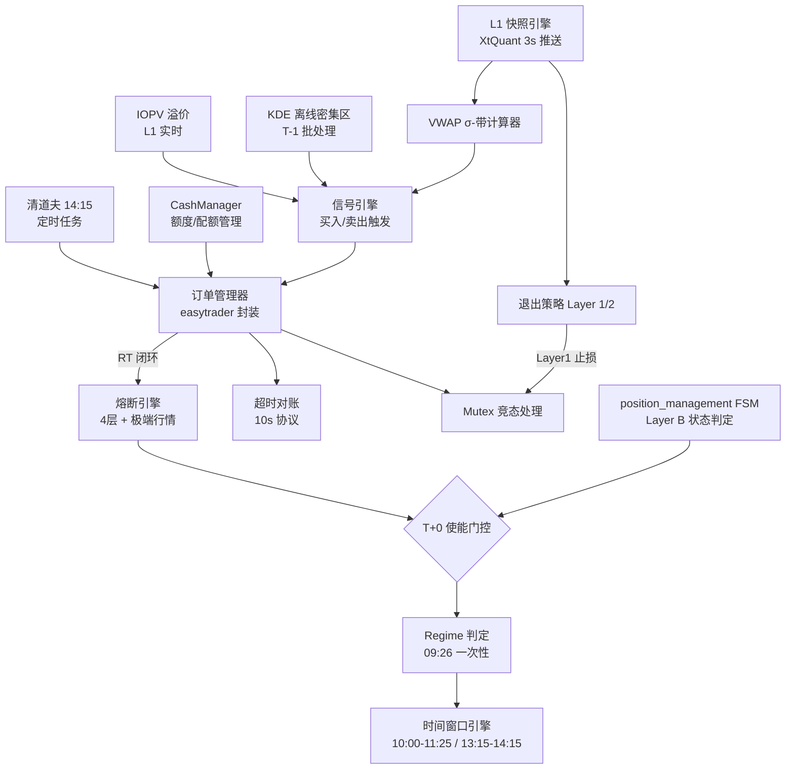

# ETF T+0 做T策略 — 实现验证套件 v1.0

> **用途**：编码时与 `t0_strategy_specification.md` v1.4 配对使用。  
> 本文档包含编码合约、验收场景、断言清单、日志规范和模块依赖图。  
> 目标：让 AI 误读规格书导致的沉默逻辑错误在上线前被发现。

---

## Part 1：编码合约（MUST / MUST NOT）

> [!CAUTION]
> 以下每一条都是**硬约束**。T+0 的错误不是"少赚"而是"幽灵仓位"或"重复下单"——直接导致资金损失。

### 1.1 Regime 日级使能

```
✅ MUST: regime_active 的计算公式（二选一 OR）：
  regime_active = (
      auction_volume_ratio > 1.5        # 09:25 集合竞价量比
      OR
      atr5_percentile > 65              # 前日 ATR_5 在 60日滚动分位
  )

✅ MUST: regime_active 在 09:26 计算一次，全天不翻转。
  即使盘中波动率大幅变化，日级 Regime 不再重新评估。

✅ MUST: auction_volume_ratio 使用增量成交量：
  auction_volume_ratio = auction_volume_today / MA(auction_volume, 10)
  auction_volume = 集合竞价 09:25 成交量（增量，非累计）

❌ MUST NOT: 不得盘中重新计算 Regime（它是日级判定，不是分钟级）。
❌ MUST NOT: 不得将 ATR_5 的分位数窗口改为非 60 日。
❌ MUST NOT: 不得用 盘中累计成交量 替代 09:25 集合竞价增量。
```

### 1.2 VWAP σ-带信号引擎

```
✅ MUST: sigma 按 60 个快照（3 分钟）滚动计算：
  deviations[i] = price[i] - vwap[i]
  raw_sigma = std(deviations[-60:])
  sigma = max(raw_sigma, price × 0.0005)    # sigma_floor

✅ MUST: VWAP 增量计算方式：
  cum_volume += snapshot.volume    # 每个 3s 快照的增量 Δvolume
  cum_amount += snapshot.amount    # 每个 3s 快照的增量 Δamount
  vwap = cum_amount / cum_volume

  ⚠️ L1 快照中 volume 通常是"全天累计量"，必须自行差分为增量：
    delta_volume = snapshot.volume - prev_snapshot.volume
    delta_amount = snapshot.amount - prev_snapshot.amount

✅ MUST: 买入信号触发 = price ≤ vwap - k_buy × sigma
✅ MUST: 卖出信号触发 = price ≥ vwap + k_sell × sigma

✅ MUST: k 值动态调整（按 trend_state）：
  trend_state = UP:    k_buy = 1.8σ, k_sell = 2.6σ
  trend_state = DOWN:  k_buy = 2.2σ, k_sell = 3.0σ
  trend_state = RANGE: k_buy = 2.0σ, k_sell = 2.8σ

✅ MUST: 挂单价后处理（必须两步，顺序不可换）：
  step1: price = round_to_tick(price, tick_size=0.001)
  step2: price = clamp(price, lower_limit, upper_limit)

❌ MUST NOT: 不得用累计 volume 代替增量 Δvolume 计算 VWAP。
❌ MUST NOT: 不得在 sigma 计算中漏掉 sigma_floor 保护。
❌ MUST NOT: 不得将 k_buy/k_sell 写死为固定值（它们依赖 trend_state）。
❌ MUST NOT: 不得在 10:00 VWAP gate 之前提交任何 T+0 挂单。
```

### 1.3 KDE 筹码信号

```
✅ MUST: KDE 密集区为离线预计算（T-1 日 18:00 批处理产出），盘中只读。
✅ MUST: 取 top_n=3 个密集区，选取最接近当前价下方的上沿作为候选。
✅ MUST: KDE 不是独立信号 — 必须 VWAP 信号先触发，KDE 只做增强。

❌ MUST NOT: 不得盘中实时计算 KDE（ROCm 计算耗时长，不是盘中操作）。
❌ MUST NOT: KDE 单独触发不构成买入理由，必须先有 VWAP 买入信号。
```

### 1.4 IOPV 溢价确认

```
✅ MUST: iopv_premium = (price - iopv) / iopv
✅ MUST: premium ≥ 0.15% → confidence = HIGH
✅ MUST: premium < 0.15% 或 数据缺失 → confidence = NORMAL
✅ MUST: IOPV 溢价不改变交易动作，只影响置信度标签。

❌ MUST NOT: 不得让 IOPV 溢价成为卖出/不卖出的决定条件。
❌ MUST NOT: 如果 IOPV 数据缺失/过时（STALE），不得阻断交易。
```

### 1.5 时间窗口硬约束

```
✅ MUST: 允许挂买单的时间窗口仅为：
  10:00 - 11:25（早盘）
  13:15 - 14:15（午盘，14:00 后仅允许反T接回买入）

✅ MUST: 反T卖出（新开）截止时间 = 14:00
  14:00-14:15 期间仅允许：正T平仓卖出 + 反T接回买入

✅ MUST: 14:15 清道夫逻辑：
  1) 撤销所有未成交的 T+0 买入挂单（含反T接回单）
  2) 保留未成交的 T+0 卖出挂单（允许尾盘平仓）
  3) 14:55 撤销一切残余 T+0 挂单

✅ MUST: close-only 时段（11:25-13:15）仅允许：
  平仓卖出（已持正T仓位的止盈/止损卖出）
  不允许任何买入或反T新开仓

❌ MUST NOT: 不得在 09:30-10:00 提交任何 T+0 挂单。
❌ MUST NOT: 不得在 14:00 后新开反T卖出仓位。
❌ MUST NOT: 不得在 14:15 后保留任何 T+0 买入挂单。
❌ MUST NOT: 不得在 close-only 时段提交买入挂单。
```

### 1.6 额度与订单管理

```
✅ MUST: T+0 额度上限 = min(base_value × 20%, available_reserve)
  base_value = 当前标的底仓市值
  available_reserve = CashManager.available_reserve()

✅ MUST: 单笔金额范围 = 10,000 ~ 14,000 元
✅ MUST: 每日最多 1 次完整 Round Trip（买+卖=1 RT）
✅ MUST: T+0 GUI 操作配额 = 20 次独占，冻结阈值 = 15 次
✅ MUST: Layer1/2 保留配额 = 10 次（止损不可被挤占）
✅ MUST: 预埋单修改最小间隔 = 3 分钟（与 σ 更新周期同步）
✅ MUST: 仅当新价位偏离当前挂单 > 2 tick 时才修改挂单

❌ MUST NOT: 不得超过 daily_round_trip_count = 1 的限制。
❌ MUST NOT: 不得让 T+0 操作消耗 Layer1/2 的保留配额。
❌ MUST NOT: 不得频繁修改挂单（< 3 分钟间隔）。
```

### 1.7 easytrader 超时对账协议

```
✅ MUST: 每笔下单后 10 秒内确认订单状态。
✅ MUST: 10 秒超时后执行强制对账（不能仅冻结）：
  Step 1: 冻结 T+0 新交易
  Step 2: 查询 easytrader 完整委托列表 + 持仓列表
  Step 3: 逐条比对内存 vs 券商：
    CASE A: 券商=已成交, 内存=SUBMITTED → 更正为 FILLED + 同步状态
    CASE B: 券商=已报/部分成交 → 撤单 + 已成交部分按微型仓位处理
    CASE C: 券商无此委托 → 更正为 REJECTED
  Step 4: 对账通过 → 解除冻结
  Step 5: 对账失败（持仓不一致）→ 保持冻结至人工介入

✅ MUST: 对账操作消耗 GUI 配额 = 0（查询类不计入）

❌ MUST NOT: 不得在超时后仅冻结而不对账（会产生幽灵仓位）。
❌ MUST NOT: 不得在对账失败时自动解除冻结。
```

### 1.8 四层熔断体系

```
✅ MUST: Layer 5 — 日内亏损 ≥ 0.3% NAV → 当日冻结，次日自动恢复
✅ MUST: Layer 7 — 5日滚动亏损 ≥ 0.5% → 冻结至窗口滑出
✅ MUST: Layer 8 — 30日滚动亏损 ≥ 1.0% → 冻结 30 天
✅ MUST: Layer 9 — 连续亏损 ≥ 3 笔 → 当日冻结，次日自动恢复
  盈利一笔即重置 consecutive_loss_count = 0

✅ MUST: 极端行情冻结：
  price_change > +6.0% → 禁止反T（涨停卖飞风险）
  price_change < -5.0% → 禁止正T（跌停锁仓风险）

❌ MUST NOT: 不得在 PnL > 0 时增加 consecutive_loss_count。
❌ MUST NOT: 不得让月度熔断自动恢复（必须等 30 天窗口滑出）。
❌ MUST NOT: 不得在涨 > +6% 时执行反T卖出。
```

### 1.9 操作禁令

```
✅ MUST: T+0 系统运行期间，代码必须拒绝任何手动修改请求。
  不得提供"手动调参"入口或 API。

❌ MUST NOT: 不得提供运行时修改 k_buy/k_sell 的接口。
❌ MUST NOT: 不得提供手动下单/修改 T+0 挂单的 UI 功能。
```

### 1.10 Mutex 竞态处理

```
✅ MUST: Layer 1 止损永远最高优先级 — 任何 T+0 操作立即让路。
✅ MUST: 场景 1（正T成交 + L1止损）→ 市价清空 sellable_qty，locked_qty 次日 09:30 强平
✅ MUST: 场景 2（反T挂单未成交 + L1止损）→ 撤接回单
✅ MUST: 场景 3（T+0传输中 + L2止盈）→ 等 10s 后执行
✅ MUST: 场景 4（反T接回已成交 + L1止损）→ 同场景 1 处理

❌ MUST NOT: 不得在 Layer 1 止损触发时继续执行 T+0 买入。
❌ MUST NOT: 不得将 locked_qty 在当日卖出（T+1 限制）。
```

---

## Part 2：验收场景（25 个关键场景）

> [!IMPORTANT]
> 每个场景有明确输入和预期输出。全部通过才可进入模拟盘。

### Regime 判定验收

| # | 场景 | 输入 | 预期结果 |
|:---:|:---|:---|:---|
| 1 | 量比触发 | auction_vol_ratio=1.8, atr5_pct=50 | regime_active=True |
| 2 | ATR 触发 | auction_vol_ratio=1.0, atr5_pct=70 | regime_active=True |
| 3 | 双否 | auction_vol_ratio=1.2, atr5_pct=60 | regime_active=False → 全天无 T+0 |
| 4 | 盘中不翻转 | 09:26 regime=False, 10:30 波动率飙升 | 仍为 False（日级不重算） |

### VWAP σ-带信号验收

| # | 场景 | 输入 | 预期结果 |
|:---:|:---|:---|:---|
| 5 | 正常买入触发 | vwap=1.055, sigma=0.0042, k_buy=2.0, price=1.0466 | 1.0466 = 1.055 - 2.0×0.0042 → 买入✅ |
| 6 | sigma_floor 保护 | price=2.0, raw_sigma=0.00001 | sigma=max(0.00001, 2.0×0.0005)=0.001 |
| 7 | 卖出触发 | vwap=1.055, sigma=0.004, k_sell=2.8, price=1.0662 | 1.0662 ≥ 1.055+2.8×0.004=1.0662 → 卖出✅ |
| 8 | Δvolume 增量 | prev_cum=1000000, cur_cum=1050000 | Δvol=50000（不是 1050000）|
| 9 | 10:00 gate 前 | 时间=09:55, 信号触发 | 禁止提交挂单 |
| 10 | tick 对齐 | 计算价=1.04661 | 对齐后=1.047（卖出时 floor）或 1.046（买入时，但 clamp 到 tick） |

### 时间窗口验收

| # | 场景 | 输入 | 预期结果 |
|:---:|:---|:---|:---|
| 11 | 早盘开头 | 时间=09:58 | 禁止任何 T+0 操作 |
| 12 | 早盘结尾 | 时间=11:26, 有持仓 | 允许平仓卖出，禁止新买入 |
| 13 | 午休期间 | 时间=12:00, 有持仓 | 允许平仓卖出，禁止买入/反T |
| 14 | 反T截止 | 时间=14:02, 无反T仓 | 禁止新开反T卖出 |
| 15 | 14:00后接回 | 时间=14:05, 有反T敞口 | 允许反T接回买入 |
| 16 | 清道夫执行 | 时间=14:15, 3个买单+1个卖单 | 撤3个买单，保留1个卖单 |

### 风控熔断验收

| # | 场景 | 输入 | 预期结果 |
|:---:|:---|:---|:---|
| 17 | 日熔断 | t0_daily_pnl=-610 元（0.305% NAV） | T+0 冻结当日 |
| 18 | 连续亏损 | 3 笔 RT 依次亏损 -15, -20, -18 元 | consecutive_loss_count=3 → 冻结 |
| 19 | 连续亏损重置 | 亏 → 亏 → 赢 → 亏 | count: 1→2→0→1（不触发） |
| 20 | 涨停冻结 | 当日涨幅 +6.5% | 禁止反T卖出，允许正T |
| 21 | 跌停冻结 | 当日跌幅 -5.5% | 禁止正T买入，允许反T |

### 超时对账验收

| # | 场景 | 输入 | 预期结果 |
|:---:|:---|:---|:---|
| 22 | 幽灵成交（CASE A）| 内存=SUBMITTED, 券商=已成交 | 状态更正 FILLED + 同步 PnL |
| 23 | 超时撤单（CASE B）| 内存=SUBMITTED, 券商=已报 | 发送撤单 + 部分成交处理 |
| 24 | 订单丢失（CASE C）| 内存=SUBMITTED, 券商=无此委托 | 更正 REJECTED |

### Mutex 竞态验收

| # | 场景 | 输入 | 预期结果 |
|:---:|:---|:---|:---|
| 25 | 正T + L1止损 | 正T买入 1.4万已成交, L1止损触发 | 市价清 sellable, locked_qty 记入 pending_sell_locked |

---

## Part 3：运行时断言清单

以下断言必须嵌入代码中，运行时违反则立即报警并阻止执行。

```python
# ===== Regime 日级 =====
assert regime_check_time.hour == 9 and regime_check_time.minute <= 26, \
    f"Regime 判定时间异常: {regime_check_time}（应在 09:26 前完成）"

# ===== VWAP =====
assert len(deviations) <= 60, \
    f"sigma 窗口 {len(deviations)} 超过 60 快照"

assert sigma >= price * 0.0005, \
    f"sigma {sigma} 低于 floor {price * 0.0005}"

for snap in vwap_snapshots:
    assert snap.delta_volume >= 0, \
        f"增量 Δvolume 为负: {snap.delta_volume}（可能用了累计量）"

# ===== 时间窗口 =====
if is_buy_order and order_type == "T0":
    assert (time(10, 0) <= now <= time(11, 25)) or \
           (time(13, 15) <= now <= time(14, 15)), \
        f"T+0 买入在禁止时段: {now}"

if is_reverse_t_sell:
    assert now <= time(14, 0), \
        f"反T卖出在 14:00 截止后: {now}"

# ===== 额度与频次 =====
t0_quota = min(base_value * 0.20, available_reserve)
assert order_amount <= t0_quota, \
    f"T+0 下单金额 {order_amount} 超过额度 {t0_quota}"

assert daily_round_trip_count <= 1, \
    f"日 RT 次数 {daily_round_trip_count} 超过上限 1"

assert t0_gui_ops < 15, \
    f"T+0 GUI 操作 {t0_gui_ops} 已达冻结阈值"

# ===== 挂单价格 =====
limit_up = math.floor(prev_close * 1.10 * 1000) / 1000
limit_down = math.ceil(prev_close * 0.90 * 1000) / 1000

assert order_price >= limit_down, \
    f"挂单价 {order_price} 低于跌停 {limit_down}"
assert order_price <= limit_up, \
    f"挂单价 {order_price} 超过涨停 {limit_up}"

assert order_price == round(order_price, 3), \
    f"挂单价 {order_price} 未 tick 对齐（0.001）"

# ===== 止盈底线 =====
if is_closing_sell:
    pnl_bps = (sell_price - buy_price) / buy_price * 10000
    # 允许止损亏损，但止盈时不得低于 25 bps
    # （这是一个 soft assert，止损场景除外）

# ===== 熔断 =====
if t0_daily_loss_pct >= 0.003:
    assert not allow_new_t0_order, \
        "日亏损已触发 0.3% 熔断，不应允许新订单"

if consecutive_loss_count >= 3:
    assert not allow_new_t0_order, \
        f"连续 {consecutive_loss_count} 笔亏损，应冻结"

if price_change_today > 0.06:
    assert not is_reverse_t_sell, \
        f"涨幅 {price_change_today:.1%} > 6%，禁止反T卖出"

if price_change_today < -0.05:
    assert not is_forward_t_buy, \
        f"跌幅 {price_change_today:.1%} < -5%，禁止正T买入"

# ===== Mutex =====
if layer1_stop_triggered:
    assert not any_t0_buy_pending, \
        "Layer 1 止损触发，不应有 T+0 买入挂单"

# ===== 操作禁令 =====
# 系统不应暴露运行时参数修改接口
assert not hasattr(t0_engine, 'set_k_buy'), \
    "T+0 引擎不应提供运行时修改 k_buy 的接口"
```

---

## Part 4：决策日志规范

> [!IMPORTANT]
> 每次信号评估、挂单、成交、熔断都必须写日志。日志是发现沉默错误的唯一手段。

### 4.1 Regime 判定日志（每日 1 条）

```json
{
  "type": "T0_REGIME",
  "timestamp": "2026-04-01 09:26:00",
  "etf_code": "512480",
  "regime_active": true,
  "reason": "auction_vol_ratio=1.8 > 1.5",
  "auction_vol_ratio": 1.8,
  "atr5_percentile": 52,
  "fsm_state": "S3_SCALED"
}
```

### 4.2 信号触发日志

```json
{
  "type": "T0_SIGNAL",
  "timestamp": "2026-04-01 10:25:03",
  "etf_code": "512480",
  "signal_type": "VWAP_BUY",
  "vwap": 1.055,
  "sigma": 0.0042,
  "k_buy": 2.0,
  "target_price": 1.0466,
  "trend_state": "RANGE",
  "kde_support": true,
  "kde_zone_price": 1.047,
  "iopv_confidence": "NORMAL",
  "action": "PLACE_LIMIT_BUY",
  "order_price": 1.047,
  "order_amount": 14000
}
```

### 4.3 Round Trip 闭环日志

```json
{
  "type": "T0_ROUND_TRIP",
  "timestamp": "2026-04-01 10:48:22",
  "etf_code": "512480",
  "direction": "FORWARD_T",
  "buy_price": 1.047,
  "sell_price": 1.055,
  "quantity": 13000,
  "gross_pnl_bps": 76.4,
  "commission": 10,
  "net_pnl_bps": 57.3,
  "net_pnl_cny": 73.6,
  "reversion_time_min": 8.5,
  "actual_be_bps": 19.1,
  "daily_round_trip_count": 1,
  "consecutive_loss_count": 0,
  "t0_daily_pnl": 73.6
}
```

### 4.4 熔断触发日志

```json
{
  "type": "T0_BREAKER",
  "timestamp": "2026-04-01 14:02:15",
  "etf_code": "512480",
  "breaker_layer": "LAYER_9_CONSECUTIVE",
  "trigger_value": 3,
  "threshold": 3,
  "action": "FREEZE_UNTIL_NEXT_DAY",
  "current_daily_pnl": -63,
  "note": "连续 3 笔亏损，均值回归假设可能当日失效"
}
```

### 4.5 超时对账日志

```json
{
  "type": "T0_RECONCILIATION",
  "timestamp": "2026-04-01 10:32:15",
  "trigger": "TIMEOUT_10S",
  "order_id": "T0_20260401_001",
  "case": "A",
  "memory_state": "SUBMITTED",
  "broker_state": "FILLED",
  "action": "CORRECT_TO_FILLED",
  "position_sync": {"locked_qty_delta": 13000, "sellable_qty_delta": 0}
}
```

### 4.6 每日审计检查项

你每天花 **2 分钟** 看以下内容，就能发现大部分沉默错误：

```
❓ 1. 今天 regime_active 判定是否合理？（与盘面波动对照）
❓ 2. 信号触发次数？（正常 0-1 次，> 2 次 = k 值可能偏低）
❓ 3. sigma 是否出现过 sigma_floor 兜底？（= 清淡时段的自我保护）
❓ 4. 有没有在禁止时段出现信号触发？（= 时间窗口逻辑有误）
❓ 5. Round Trip 的 actual_be_bps 是否与理论 12.1 bps 一致？
❓ 6. GUI 操作次数接近 15 吗？（如果频繁接近 = 修改挂单过多）
❓ 7. 有没有 RECONCILIATION 日志？（有 = 超时对账被触发，需关注）
```

---

## Part 5：模块依赖图与编码顺序

### 5.1 依赖关系



### 5.2 推荐编码顺序

```
阶段 1 — 离线管线 + 数据基础（无实时依赖，可独立测试）
  ① KDE 密集区批处理（T-1 日 18:00 运行）
  ② Regime 分类器（auction_volume_ratio + ATR 分位）
  → 验收：场景 1-4 全部通过

阶段 2 — 盘中信号核心（依赖 L1 引擎）
  ③ L1 快照引擎接口（XtQuant 订阅 + 增量 Δvolume 处理）
  ④ VWAP σ-带计算器（含 sigma_floor + 滚动窗口）
  ⑤ 信号引擎（VWAP买入/卖出 + KDE增强 + IOPV确认）
  ⑥ 时间窗口引擎（含 close-only 区间 + 14:00 反T截止）
  → 验收：场景 5-16 全部通过

阶段 3 — 订单管理 + 风控（依赖前两阶段）
  ⑦ 订单管理器（easytrader 封装 + GUI 配额计数）
  ⑧ 超时对账协议（10s + 3 CASE 处理）
  ⑨ 熔断引擎（4 层 + 极端行情 + consecutive_loss_count）
  ⑩ Mutex 竞态处理（4 场景）
  → 验收：场景 17-25 全部通过

阶段 4 — 生命周期管理
  ⑪ 清道夫定时任务（14:15 + 14:55）
  ⑫ T+0 日志系统（Part 4 格式）
  ⑬ 模拟盘数据归档（§15.4 JSON 格式）
```

### 5.3 关键接口定义

```python
# === 各模块之间的数据契约 ===

# Regime → 信号引擎
class RegimeResult:
    regime_active: bool          # 日级开关
    reason: str                  # "auction_vol" | "atr_pct" | "both"
    auction_vol_ratio: float
    atr5_percentile: float

# L1 快照 → VWAP 计算器
class L1Snapshot:
    timestamp: datetime
    price: float                 # 最新价
    delta_volume: int            # 增量成交量（非累计！）
    delta_amount: float          # 增量成交额（非累计！）
    ask1: float
    bid1: float
    iopv: float | None           # 可能缺失

# 信号引擎 → 订单管理器
class T0Signal:
    signal_type: str             # "VWAP_BUY" | "VWAP_SELL" | "KDE_ENHANCED_BUY"
    target_price: float          # tick 对齐 + clamp 后
    amount: float                # 下单金额
    confidence: str              # "HIGH" | "NORMAL"
    trend_state: str             # "UP" | "DOWN" | "RANGE"
    k_value: float               # 实际使用的 k 值

# 订单管理器 → 熔断引擎
class RoundTripResult:
    direction: str               # "FORWARD_T" | "REVERSE_T"
    buy_price: float
    sell_price: float
    net_pnl: float               # 含佣金的净PnL
    net_pnl_bps: float
    actual_be_bps: float         # 实际 BE

# KDE 批处理输出（文件接口，非 API）
# 读取：data/kde_zones/{etf_code}_{date}.json
# 字段：dense_zones: [{upper: float, lower: float, strength: float}]
```

---

## 附录：模拟盘操作手册

```
模拟盘 = XtQuant 模拟账户运行全量代码，订单提交至模拟撮合

持续时间：≥ 60 个交易日（v1.4 修订，原 20 天不足）

每天检查：
  1. Regime 判定与实际盘面是否一致？
  2. sigma 是否出现"自适应逃跑"？（价格逼近目标时 sigma 膨胀）
  3. 挂单是否经过 tick 对齐 + 涨跌停 clamp？
  4. 有没有超时对账事件？
  5. GUI 操作次数合理吗？
  6. §15.4 参数验证清单的 10 项数据是否每日归档？

退出模拟盘进入实盘小额的条件（全部满足）：
  ① 25 个验收场景全部通过（单元测试级）
  ② 信号触发 ≥ 3 次
  ③ 模拟净 PnL ≥ 0
  ④ easytrader P95 延迟 ≤ 8 秒
  ⑤ 无幽灵成交事件
  ⑥ 无运行时断言触发
  ⑦ 日志格式完整，每日审计 7 项无异常
```
