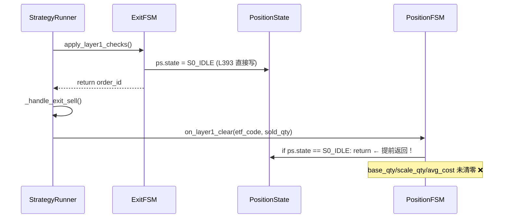

# 集成代码审计报告

> 审计范围：`main.py`(43L)、`strategy_config.py`(111L)、`strategy_runner.py`(653L)、`tests/test_integration/test_strategy_runner.py`(356L)
> 基准：[integration_prompt.md](file:///d:/Quantitative_Trading/.trae/prompts/integration_prompt.md) + 五个模块实际 API

---

## P0 — 会导致运行时崩溃或数据损坏

### ❶ `on_lifeboat_rebuy()` 方法不存在

| 调用处 | [strategy_runner.py:L514](file:///d:/Quantitative_Trading/strategy_runner.py#L514) |
|:---|:---|
| 报错 | `AttributeError: 'PositionFSM' object has no attribute 'on_lifeboat_rebuy'` |

`grep "on_lifeboat_rebuy" position_fsm.py` 返回**零结果**。`PositionFSM` 上不存在此方法。

**更深层问题**：`ExitFSM.apply_lifeboat_buyback_check()` 内部已自行调用 `confirm_order()` 并设置 `ps.lifeboat_used = True` 再 `save()`（[exit_fsm.py:L510-522](file:///d:/Quantitative_Trading/exit/exit_fsm.py#L510-L522)）。所以 `_handle_lifeboat_rebuy()` 整个方法是多余的double-confirm。

**修复方案**：删除 `_handle_lifeboat_rebuy()` 和 L473-474 的调用。`apply_lifeboat_buyback_check()` 的返回 `order_id` 仅用于日志即可：
```diff
 if oid3 is not None:
-    self._handle_lifeboat_rebuy(now=now, etf_code=etf_code, order_id=int(oid3))
+    self._logger.info("lifeboat buyback executed for %s, oid=%s", etf_code, oid3)
```

---

### ❷ ExitFSM 预设状态 → PositionFSM 回调被幂等守卫跳过（仓位 qty 字段永远不清零）

这是**最严重的数据完整性缺陷**。

**调用链**：



**证据**：

[on_layer1_clear](file:///d:/Quantitative_Trading/position/position_fsm.py#L256-L257) 的幂等守卫：
```python
if ps.state == FSMState.S0_IDLE:
    return  # ExitFSM 已设 S0 → 直接跳过！
```

[on_layer2_reduce](file:///d:/Quantitative_Trading/position/position_fsm.py#L220-L221) 同理：
```python
if ps.state == FSMState.S5_REDUCED:
    return  # ExitFSM 已设 S5 → 直接跳过！
```

**后果**：全仓平仓（Layer1）后，`base_qty`、`scale_1_qty`、`avg_cost`、`effective_slot` 等字段保留脏值。下一个入场周期可能基于这些脏数据做出错误决策。

**修复方案**（二选一）：

**方案 A — 在回调前临时回退 ExitFSM 设置的状态**（推荐，不改模块内部）：
```python
def _handle_exit_sell(self, *, now, etf_code, order_id, ps):
    # 记录 ExitFSM 设置前的原始状态
    state_before_exit = ps.state  # ExitFSM 已改, 但我们知道方向

    res = self._trading.confirm_order(order_id, timeout_s=10.0)
    if res.status != OrderStatus.FILLED:
        return
    fill = _extract_fill(res, fallback_qty=int(ps.total_qty))
    sold_qty = ...

    # 关键：临时回退状态以绕过幂等守卫
    if ps.state == FSMState.S0_IDLE:
        ps.state = FSMState.S2_BASE  # 回退到一个合法的前置状态
        self._pos_fsm.on_layer1_clear(etf_code=etf_code, sold_qty=sold_qty)
    elif ps.state == FSMState.S5_REDUCED:
        ps.state = FSMState.S2_BASE
        self._pos_fsm.on_layer2_reduce(etf_code=etf_code, sold_qty=sold_qty)
```

**方案 B — 传递 layer 标识并直接操作 qty 字段**：
```python
def _handle_exit_sell(self, *, now, etf_code, order_id, ps, layer: str):
    ...
    if layer == "layer1":
        # 手动清零（因为 on_layer1_clear 会被幂等守卫跳过）
        ps.total_qty = max(0, int(ps.total_qty) - sold_qty)
        ps.base_qty = 0
        ps.scale_1_qty = 0
        ps.scale_2_qty = 0
        ps.avg_cost = 0.0
        ps.effective_slot = 0.0
        # ... 其他字段
    elif layer == "layer2":
        # 仿 on_layer2_reduce 的拆分逻辑
        ...
```

> [!WARNING]
> 方案 B 复制了 PositionFSM 的内部逻辑，违背 DRY 原则。方案 A 更清洁但有「状态回退」的 hack 感。**最佳方案是修改 PositionFSM 的回调去掉幂等守卫、或改为检查 `base_qty > 0` 而非 `state`**，但这违反了提示词中「不修改现有模块」的约束。

---

### ❸ Lifeboat 回购双重确认

| 位置 | [strategy_runner.py:L501-515](file:///d:/Quantitative_Trading/strategy_runner.py#L501-L515) |
|:---|:---|
| ExitFSM 内部 | [exit_fsm.py:L510](file:///d:/Quantitative_Trading/exit/exit_fsm.py#L510) 已调用 `confirm_order()` |

`apply_lifeboat_buyback_check()` 返回 order_id 后，`_handle_lifeboat_rebuy()` 再次调用 `confirm_order()`。由于 XtTradingAdapter 的 confirm_order 是轮询 query_orders()，双重确认不会报错但浪费了 10 秒 timeout。然后调用不存在的 `on_lifeboat_rebuy()`（P0 ❶）。

---

## P1 — 可能导致错误行为

### ❹ Layer1/Layer2 路由逻辑有误

| 位置 | [strategy_runner.py:L495-498](file:///d:/Quantitative_Trading/strategy_runner.py#L495-L498) |
|:---|:---|

```python
if sold_qty >= before_total and before_total > 0:
    self._pos_fsm.on_layer1_clear(...)
else:
    self._pos_fsm.on_layer2_reduce(...)
```

该逻辑用 `sold_qty >= total_qty` 来判断是 Layer1 还是 Layer2。问题：
- Layer1 部分成交（sold_qty < total）→ 误路由到 `on_layer2_reduce()`
- 虽然目前此 bug 被 P0 ❷ 掩盖（两个回调都会被幂等守卫跳过），但修复 P0 ❷ 后此 bug 会暴露

**修复**：`_handle_exit_sell()` 增加 `layer: str` 参数：
```diff
-def _handle_exit_sell(self, *, now, etf_code, order_id, ps):
+def _handle_exit_sell(self, *, now, etf_code, order_id, ps, layer: str):
```

---

### ❺ `score_soft` 始终为 0.0

| 位置 | [strategy_runner.py:L419](file:///d:/Quantitative_Trading/strategy_runner.py#L419) |
|:---|:---|

`score_soft = 0.0` 被传给 `apply_layer1_checks()` 和 `apply_layer2_if_needed()`。Exit Layer2 的核心逻辑是「分数驱动减仓」，0 分意味着**永远触发减仓**（或永远不触发，取决于阈值方向）。

实际上策略需要 `entry.scoring.compute_score()` 计算实时分数，或至少缓存日频分数。

**修复建议**：在 `_pre_open()` 中计算并缓存每个 ETF 的 score_soft，盘中使用缓存值。

---

## P2 — 设计建议

### ❻ 单日运行

`main.py` 的 `run_day()` 执行一天后退出。如果需要 7×24 守护运行，需在 `main()` 外加 `while True` 循环 + 等待下一交易日。当前实现需要外部调度（如 Task Scheduler）。

### ❼ 测试中 `_FakeData.get_snapshot()` 的时间副作用

`_FakeData.get_snapshot()` 每次调用 `self._now()` 来获取当前时间。但在 `_process_position_tick()` 中，`get_snapshot()` 被 `_compute_stop()` 和 `_evaluate_scale_placeholder()` 多次间接调用，每次都消耗 `_NowSeq` 的一个时间点。这可能导致测试中时间推进不可预测。

建议 `_FakeData` 缓存 `get_snapshot()` 结果（按 etf_code），或改用 `peek()` 而非 `__call__`。

---

## ✅ 正确实现的部分

| 检查项 | 状态 |
|:---|:---|
| 3 个 FSM 共享同一 PortfolioState | ✅ |
| 3 个 FSM 共享同一 StateManager | ✅ |
| ExitFSM 和 PositionFSM 共享 EXIT_MUTEX | ✅（默认参数） |
| 数据质量检查 → assert_action_allowed | ✅ |
| 每个模块调用独立 try/except | ✅ |
| is_trading_time() 守卫 | ✅ |
| 状态变更后 save() | ✅ |
| GUI freeze mode 条件处理 | ✅ |
| t0_daily_pnl 日重置 | ✅ |
| pnl 滚动窗口更新 | ✅ |
| NAV 同步 | ✅ |
| HWM 更新 (on_post_close) | ✅ |
| highest_high 逐 tick 更新 | ✅ |
| 目录初始化 | ✅ |
| 重启恢复 (recover_on_startup) | ✅ |
| 双适配器工厂 (xt/gui) | ✅ |
| CLI 参数覆盖 | ✅ |
| T0 生命周期 (prepare→execute→reset) | ✅ |
| 入场填充确认 → PositionFSM 回调 | ✅ |
| 资金锁定/释放 (CashManager) | ✅ |
| Phase2 日频扫描 (post_close) | ✅ |

---

## 修复优先级

| 序号 | 严重度 | 修复工作量 | 说明 |
|:---|:---|:---|:---|
| ❷ | P0 | 中 | ExitFSM/PositionFSM 状态竞争 — 涉及架构决策 |
| ❶ | P0 | 小 | 删除不存在的方法调用 |
| ❸ | P0 | 小 | 删除冗余的 _handle_lifeboat_rebuy |
| ❹ | P1 | 小 | 增加 layer 参数 |
| ❺ | P1 | 中 | 需要接入评分管道 |
