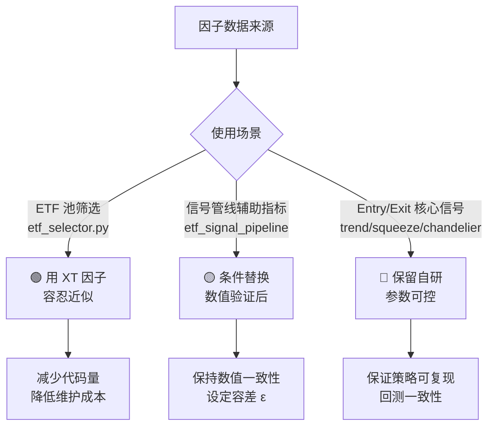

# 迅投接口替换计划 — 深度分析报告

## 总体评价

> [!TIP]
> 这份替换计划的**梳理质量非常高**，问题定位精准、代码行号准确、风险描述到位。两部分（接口调用缺陷 + 因子替换）逻辑清晰，建议完全值得落地。下面我从 **架构师视角** 逐条深度评审，补充你可能遗漏的点。

---

## 第一部分：接口调用缺陷（4 条）—— 全部有效，建议修复

### 1.1 `download_history_data` 多传第 5 参数 — ✅ 有效，中优先级

| 维度 | 评估 |
|------|------|
| 问题确认 | **属实**。L50 传 `None` 作为第 5 位置参数 |
| 实际危害 | 某些 xtdata 版本可能将 `None` 映射到 `incrementally` 参数（关键字参数），不会报错但也不会增量下载；另一些版本可能直接 `TypeError` |
| 修复难度 | 低 — 删除末尾 `None` 或改为关键字传参 |

> [!NOTE]
> 值得注意的是，`download_history_data2` 的回退分支（L53-L62）也有类似问题：`fn(stock_list, period, start_time, end_time, None, None)` 尝试传 6 参、5 参、4 参。虽然用了 try/except 做渐进降级，但这种"试错式调用"本身就是代码异味，建议一并清理为版本感知（检测签名后一次调用）。

---

### 1.2 `subscribe_quote` callback 被当 period — ✅ 有效，**最高优先级**

| 维度 | 评估 |
|------|------|
| 问题确认 | **属实且严重**。[data_adapter.py:L159](file:///d:/Quantitative_Trading/core/adapters/data_adapter.py#L159) `fn2(etf_code, callback)` — callback 函数对象会落入 `period` 参数位 |
| 实际危害 | `period` 变成一个函数对象 → 订阅失败（无数据推送） → callback 永远不触发 → **静默失效** |
| 纠正信息 | [realtime.py:L172](file:///d:/Quantitative_Trading/etf_chip_engine/realtime.py#L172) 已正确使用 `subscribe_quote(code, period="tick", count=0, callback=on_data)` |

> [!CAUTION]
> 这个 bug 最危险的地方在于**不会报错**，订阅就是"静默空转"。如果有业务路径走到 `data_adapter.py` 的 `subscribe_quote`（而非 `realtime.py`），则整个实时数据链路断裂。建议合并两处调用为统一入口。

---

### 1.3 `get_market_data` 返回结构误判 — ✅ 有效，高优先级

| 维度 | 评估 |
|------|------|
| 问题确认 | **属实**。根据指南，K 线周期返回 `{field: DataFrame}`，tick 周期返回 `{stock_code: ndarray/DataFrame}` |
| 代码问题 | [data_adapter.py:L80](file:///d:/Quantitative_Trading/core/adapters/data_adapter.py#L80) `data[etf_code]` 在 K 线周期下不可能命中（key 是 `'close'`, `'time'` 等） |
| 实际表现 | K 线走 L80 分支时，条件 `etf_code in data` 为 False → 进入 L99 的 pandas 降级解析 → 也大概率失败 → 返回空列表 |

> [!IMPORTANT]
> 你的建议“统一封装解析层，按 period 区分返回结构”非常正确。补充两点落地建议：
> 1) `get_market_data`/`get_market_data_ex` 在不同版本与不同 period 下的返回 shape 可能不同，不应在业务层写死“dict 的 key 一定是 code 或 field”。建议把“shape 识别 + 统一输出”为单一入口能力（上层永远拿到统一的 DataFrame/ndarray）。
> 2) 实务上可以优先偏向 `get_market_data_ex`（尤其是 tick 和特色数据），但仍需以“解析层兜底兼容”为前提，而不是假设其对所有 period 都固定返回 `{stock_code: DataFrame}`。你在 [xtdata_provider.py](file:///d:/Quantitative_Trading/etf_chip_engine/data/xtdata_provider.py#L237-L262) 中优先使用 `get_market_data_ex` 获取 tick 的方向是正确的。

---

### 1.4 tick 回放 `field_list=[]` — ✅ 有效，低优先级

| 维度 | 评估 |
|------|------|
| 问题确认 | [realtime.py:L211](file:///d:/Quantitative_Trading/etf_chip_engine/realtime.py#L211) 传 `field_list=[]` |
| 实际影响 | 多数 xtdata 版本视 `[]` 为全字段返回，不造成错误。但习惯不好，且不排除某些版本视为空结果 |
| 建议 | 显式传入所需字段列表，如 `["time", "lastPrice", "amount", "volume"]`，与 `xtdata_provider.py` 保持一致 |

---

### 接口缺陷修复优先级排序

```
P0  1.2 subscribe_quote — 静默失效、实时链路断裂
P1  1.3 get_market_data — 返回结构假设错误、影响 K 线获取
P2  1.1 download_history_data — 兼容回退可能崩溃
P3  1.4 field_list=[] — 低风险但应规范
```

---

## 第二部分：因子替换评估 — 需分层决策

### 🔑 核心前提问题（你的文档中未提及）

> [!WARNING]
> **迅投因子数据是否覆盖 ETF？** 因子指南中所有示例和说明均针对**个股**（如 `factor_quality` 的产权比率、存货周转率等），这些对 ETF 无意义。`factor_technical` 和 `factor_momentum` 中的技术指标理论上可能支持 ETF 代码，但必须“按可用性标准”实测验证：
> ```python
> xtdata.download_history_data('510050.SH', 'factor_technical', '', '')
> data = xtdata.get_market_data_ex([], ['510050.SH'], period='factor_technical')
> ```
> 建议将“可用”定义为：
> - 非空：至少能返回可解析结构，且大部分交易日不为全 NaN/全 0
> - 可对齐：时间戳/交易日能与策略使用的 K 线对齐（不出现系统性偏移）
> - 可覆盖：对你计划替换的 ETF 池（而非单只）覆盖率达标
> - 可解释：对关键指标（如 MA/BIAS/BOLL）做数值抽样对比，差异在可接受阈值内
> 若不满足，则因子替换只能用于特定子集或应整体放弃。

### 替换可行性分层评估

#### 🟢 安全区 — 推荐替换

| 替换项 | 当前实现 | XT 因子 | 口径一致性 | 推荐理由 |
|--------|----------|---------|-----------|---------|
| MA5/MA10 | SMA(close, N) | `mac5`/`mac10` | ✅ 高 | 标准 SMA，无歧义 |
| BIAS10/20 | `(close-ma)/ma` | `bias10`/`bias20` | ✅ 高 | 标准定义 |
| 量比 (vol/vol_ma) | `vol_t/mean(vol[-5:])` | `davol5`/`davol20` | ✅ 高 | 简单比值 |
| vol_ma20 | `mean(vol[-20:])` | `vol20` | ✅ 高 | 简单均值 |

**适用场景**：ETF 筛选 (`etf_selector.py`)、信号管线中的**辅助判断**（非核心 entry/exit 条件）

---

#### 🟡 灰色区 — 需确认后决定

| 替换项 | 风险点 | 确认方法 |
|--------|--------|---------|
| EMA12/EMA26 → `emac12`/`emac26` | EMA 的初始化方式（第一个值用 SMA 还是 close[0]）可能不同，**单独使用影响小**，但用于 MACD 差值运算时**误差会放大** | 取同一 ETF 同一区间，对比本地 `_ema()` 结果与 XT `emac12` 的数值差异 |
| Bollinger 上下轨 → `boll_up`/`boll_down` | XT 默认参数是否为 `(20, 2σ)`？你的代码用的是 `(20, 2σ)`，但 XT 未在文档中明确 | 同上，数值对比 |
| Variance20 替代标准差 | 你的代码用 `std(returns, 20)`, XT 给的是"20日**年化收益方差**"，口径差异大：年化 = `daily_var × 252`，且"收益方差" ≠ "收盘价标准差" | **不建议直接替换**，除非反推确认口径一致 |

---

#### 🔴 危险区 — 不建议替换

| 替换项 | 核心问题 |
|--------|---------|
| **MACD hist → `macdc`** | `macdc` 描述为"平滑异同移动平均线"= MACD 指标本身。但 MACD 指标有 3 个值（DIF, DEA, Hist），`macdc` 只返回 1 个值。你的策略 `trend.py` 强依赖 `hist[-1] > hist[-2]`（histogram 柱状图的升/降），如果 `macdc` 返回的是 DIF 或 DEA 而非 Hist，**信号逻辑完全反转**。|
| **ATR → `atr6`/`atr14`** | ① 窗口不匹配：代码用 `ATR(20)` (squeeze) 和 `ATR(12)` (chandelier)，XT 只提供 6 和 14 ② 平滑方式未知：代码 squeeze 用 SMA，chandelier 用 Wilder EMA，XT 未说明 ③ ATR 直接驱动 Keltner Channel 宽度和 Chandelier Stop，**窗口差 1 天都会改变信号** |
| **Chandelier ATR(12)** | 出场信号的核心参数，Wilder 平滑与 SMA 在震荡行情中差异可达 10-20%，直接影响止损位 |

---

### 替换策略的架构级建议



> [!IMPORTANT]
> **核心原则**：信号生成模块（entry/exit）是策略的"大脑"，必须保证**参数透明、可回测、可复现**。使用第三方因子相当于引入黑盒：你无法控制 XT 何时改变计算逻辑或更新频率，且回测时需要历史因子数据，而 XT 的因子数据是否保留完整历史也未可知。

---

## 第三部分：整体结论与行动建议

### 这个替换计划是否合理？

**合理，但需要分层执行。** 你的文档在"发现问题"阶段非常出色，但在"替换决策"阶段需要加入更多约束条件。

### 是否有必要？

| 部分 | 必要性 | 理由 |
|------|--------|------|
| 接口调用修复（Section 1） | **必须** | 1.2 和 1.3 是实际 bug，会导致生产环境数据链路故障 |
| 因子替换 — 🟢 安全区 | **建议** | 减少代码量和维护负担，且风险极低 |
| 因子替换 — 🟡 灰色区 | **可选** | 需先数值验证，收益有限 |
| 因子替换 — 🔴 危险区 | **反对** | 策略核心信号不应依赖黑盒因子 |

### 推荐的行动序列

1. **立即**：修复 P0/P1 接口缺陷（`subscribe_quote` 和 `get_market_data` 返回结构）
2. **短期**：实测 XT 因子是否覆盖 ETF 代码，结果决定后续因子替换是否可行
3. **中期**：替换 🟢 安全区因子（MA/BIAS/volume），在 `etf_selector.py` 和 `etf_signal_pipeline.py` 的非核心路径中使用
4. **不做**：MACD histogram、ATR、Chandelier 保留自研实现
