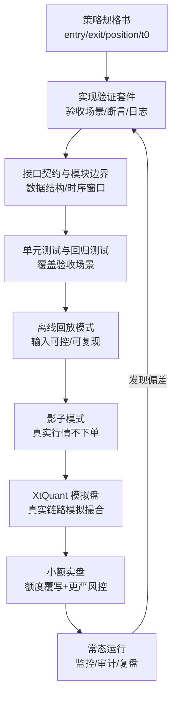
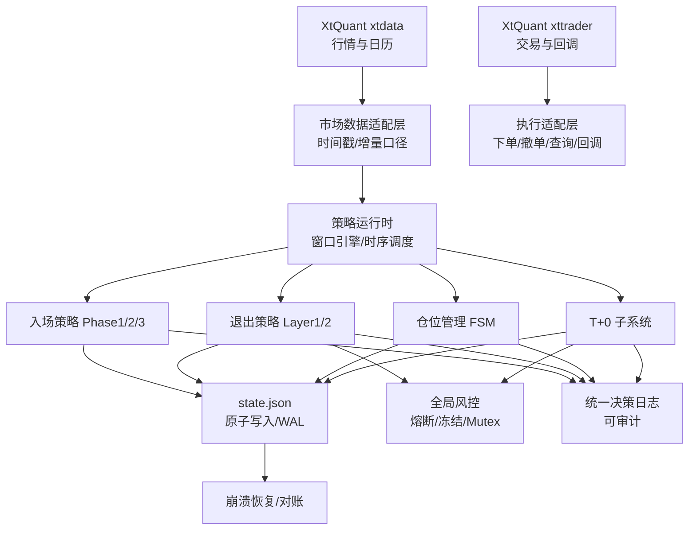

# 量化交易系统分阶段研发流程化 Spec

## Why
当前系统由多个策略子系统（入场/退出/仓位管理/T+0）与 XtQuant 行情/交易链路组合而成，复杂度高且极易出现“沉默逻辑错误”（不报错但行为偏离策略文档）。需要一套可重复执行的研发流程，把“策略复现正确性”放到开发第一优先级。

## What Changes
- 建立“策略规格书 → 实现验证套件 → 代码实现 → 自动验收”的闭环研发流程
- 将系统开发拆分为可独立交付的阶段（foundation → 数据 → 状态/执行 → 策略 → 模拟盘 → 小额实盘 → 常态运行）
- 将研发按交易日时序窗口拆分（盘前/盘中/盘后），降低跨时段耦合导致的复现错误
- 定义模块边界、数据契约、不可变约束（MUST/MUST NOT）落地路径（断言/测试/日志）
- 定义渐进部署与回滚准则，优先使用 XtQuant 模拟账户实盘测试收集证据

## Impact
- Affected specs:
  - 入场策略（entry_strategy_specification.md + entry_implementation_verification.md）
  - 退出策略（exit_strategy_specification.md + exit_implementation_verification.md）
  - 仓位管理（position_management_specification.md + position_management_verification.md）
  - T+0 做T（t0_strategy_specification.md + t0_implementation_verification.md）
  - XtQuant 数据/交易链路（XtQuant数据获取使用指南.md、XtQuant交易模块使用指南.md）
- Affected code:
  - 将新增/重构：模块化目录结构、测试框架、回放/影子模式、统一日志与 state.json 持久化、XtQuant 适配层

## Shared Constraints（跨模块硬约束目录）

本节提炼“跨模块共享且必须一致”的硬约束，作为入场/退出/仓位管理/T+0/XtQuant 数据与交易适配层的共同契约。策略逻辑本身不在此处重述，仅固化共用口径与工程级不可变规则。

### Shared Constraint 列表（v1）

#### 1) 数据源唯一性：xtdata / xttrader
- **约束名**：DataSource.OnlyXtQuant
- **来源文档**：XtQuant数据获取使用指南.md；XtQuant交易模块使用指南.md；checklist.md(3/5)
- **违反风险**：行情与交易口径不一致、数据延迟不可控、无法复现实盘行为，导致“沉默偏离”
- **建议断言/测试点**：
  - 单元测试：数据适配层仅通过 XtQuantProvider 抽象注入，禁止在策略代码中直接引入非 XtQuant 数据源
  - 静态检查：禁止出现 tushare/pandas_datareader 等依赖与导入

#### 2) L1 快照的“增量口径”与时间戳新鲜度
- **约束名**：MarketData.L1DeltaAndStaleness
- **来源文档**：t0_implementation_verification.md(1.2)；t0_strategy_specification.md(3.2)；entry_strategy_specification.md(6.3/9.2)；exit_strategy_specification.md(8.4)；position_management_verification.md(断言与口径条款)
- **违反风险**：VWAP/σ 计算被累计量污染；数据停滞时继续下单造成误触发、重复下单或错过止损
- **建议断言/测试点**：
  - 运行时断言：Δvolume、Δamount 必须非负；出现负值/0 值快照标记为 STALE 并跳过
  - 运行时断言：系统时间与最新快照时间差 > 15s → data_feed=STALE
  - 场景测试：注入一段“累计量回退/重置”的快照序列，应触发 STALE 且不更新 VWAP

#### 3) VWAP 的窗口边界与热身规则（跨模块一致）
- **约束名**：MarketData.VwapWindowAndWarmup
- **来源文档**：entry_strategy_specification.md(6.3，VWAP 从 09:30 开始、09:50 前不使用斜率)；entry_implementation_verification.md(1.4/断言)；t0_implementation_verification.md(1.2/1.5)；t0_strategy_specification.md(3.2/7.1)
- **违反风险**：集合竞价快照引入异常大单导致 VWAP 偏移；早盘热身期错误确认导致追涨或错误拒绝
- **建议断言/测试点**：
  - 单元测试：任何 timestamp < 09:30:00 的快照不得进入 VWAP 累计
  - 运行时断言：entry Phase 3 使用 vwap_slope 前 current_time ≥ 09:50
  - 场景测试：构造 09:22~09:29 大额成交快照，VWAP 不应被污染

#### 4) 挂单价精度（tick）与涨跌停边界（clamp）
- **约束名**：Pricing.TickAndLimitClamp
- **来源文档**：entry_strategy_specification.md(1.6/7)；entry_implementation_verification.md(1.6/断言)；exit_strategy_specification.md(2.6)；exit_implementation_verification.md(1.5/断言)；t0_implementation_verification.md(1.2)；XtQuant数据获取使用指南.md(PriceTick/UpStopPrice/DownStopPrice 字段)
- **违反风险**：券商拒单（价格越界/精度错误）；长期滑点放大；触发“未成交但系统认为已提交”的异常链
- **建议断言/测试点**：
  - 运行时断言：所有委托价格必须满足 0.001 精度；且在 [limit_down, limit_up] 区间
  - 单元测试：对不同 prev_close 与 tick 的组合验证 limit_up 用 floor、limit_down 用 ceil 的离散化

#### 5) 挂单价归一化的“意图分型”（统一但不一刀切）
- **约束名**：Pricing.NormalizeByOrderIntent
- **来源文档**：entry_strategy_specification.md(买入 tick_ceil(Ask1×1.003)、卖出 tick_floor(Bid1×0.98))；exit_strategy_specification.md(2.6)；t0_implementation_verification.md(1.2, round_to_tick+clamp)；t0_strategy_specification.md(7.1/3.2)
- **违反风险**：把“抢成交”的规则误用于“预埋 Maker”，导致期望收益崩溃；或相反导致关键止损/退出无法成交
- **建议断言/测试点**：
  - 单元测试：按 OrderIntent.kind 分别校验价格归一化路径：
    - AGGRESSIVE_BUY：tick_ceil；AGGRESSIVE_SELL：tick_floor
    - PASSIVE_BAND_ORDER（VWAP/KDE 预埋）：round_to_tick
  - 场景测试：同一原始目标价在不同 intent 下输出不同对齐结果但均 clamp 合法

#### 6) T+1 约束：sellable_qty / locked_qty 的真相与跨日强平
- **约束名**：Position.TPlusOneLockedHandling
- **来源文档**：exit_strategy_specification.md(1.6/8.10)；exit_implementation_verification.md(1.6/断言)；position_management_specification.md(7.7)；t0_implementation_verification.md(1.10)；t0_strategy_specification.md(9.4)
- **违反风险**：尝试卖出锁定份额导致拒单；或未记录 locked_qty 导致次日遗漏强平，形成裸露风险
- **建议断言/测试点**：
  - 运行时断言：任何卖出 qty ≤ sellable_qty
  - 场景测试：当 locked_qty>0 且需要 FULL_EXIT，必须写入 pending_sell_locked 且次日 09:30 无条件执行

#### 7) state.json WAL：原子写入 + “先写状态后执行”
- **约束名**：State.WALAtomicAndWriteBeforeAct
- **来源文档**：exit_strategy_specification.md(5 崩溃恢复)；exit_implementation_verification.md(1.9)；entry_implementation_verification.md(1.8)；position_management_verification.md(1.2)；formalize-quant-system-workflow spec.md(Phase 0/2)
- **违反风险**：崩溃后无法恢复真实意图；重复下单；现金/配额状态重建失败
- **建议断言/测试点**：
  - 单元测试：StateStore.write() 必须先写 .tmp 再 os.replace；禁止直接写入目标文件
  - 场景测试：模拟崩溃（写 .tmp 未 replace）启动时必须告警并进入安全模式

#### 8) 真相来源：券商持仓 + 当日委托，而非内存/本地状态
- **约束名**：Recovery.BrokerIsTruth
- **来源文档**：exit_strategy_specification.md(5 崩溃恢复)；exit_implementation_verification.md(1.9)；entry_implementation_verification.md(1.8)；t0_implementation_verification.md(1.7)
- **违反风险**：幽灵仓位、重复下单、卖出数量超出可用余额
- **建议断言/测试点**：
  - 启动验收：启动恢复流程必须包含（state.json + 委托列表 + 持仓列表）的三方核对
  - 场景测试：state=SUBMITTED 但券商=FILLED 时，应更正为 FILLED 并同步仓位

#### 9) 10 秒超时强制对账（不可仅冻结）
- **约束名**：Execution.ReconcileOnTimeout10s
- **来源文档**：t0_implementation_verification.md(1.7)；t0_strategy_specification.md(7.5)；exit_strategy_specification.md(8.1)；exit_implementation_verification.md(1.9)
- **违反风险**：超时后仅冻结会遗漏“实际已成交”的状态，形成幽灵仓位与重复下单
- **建议断言/测试点**：
  - 单元测试：对账 CASE A/B/C 三分支覆盖，且“对账失败不自动解冻”
  - 运行时断言：下单后 10 秒内未确认 → 必须触发对账（含委托列表+持仓列表）

#### 10) 查询频率与回调非阻塞
- **约束名**：Execution.NonBlockingCallbackAndQueryBudget
- **来源文档**：exit_strategy_specification.md(1.8/8.4)；exit_implementation_verification.md(1.8)；XtQuant交易模块使用指南.md(set_relaxed_response_order_enabled 提示)；formalize-quant-system-workflow checklist.md(5)
- **违反风险**：GUI/交易线程被阻塞导致回调堆积；止损延迟；被券商风控踢下线
- **建议断言/测试点**：
  - 运行时断言：两次持仓查询间隔不得 < 10 秒（退出验证套件）
  - 场景测试：在回调中触发查询路径必须走异步/队列，不得同步阻塞

#### 11) 全局 Mutex：Layer 1 最高优先级 + 持锁上限
- **约束名**：Concurrency.GlobalMutexPriority
- **来源文档**：exit_strategy_specification.md(8.3)；exit_implementation_verification.md(断言)；position_management_verification.md(1.6)；t0_implementation_verification.md(1.10)；t0_strategy_specification.md(9.4)
- **违反风险**：止损被低优先级操作阻塞；并发下单导致重复委托、超卖或资金冻结错乱
- **建议断言/测试点**：
  - 运行时断言：Mutex 持锁时长 < 2 秒；Layer 1 可抢占
  - 场景测试：T+0 传输中遇 Layer 2 → WAIT≤10s；Layer 1 不得因等待超过 2s

#### 12) T+0 时间窗口与清道夫（系统级一致）
- **约束名**：T0.TimeWindowsAndSweeper
- **来源文档**：t0_implementation_verification.md(1.5)；t0_strategy_specification.md(8)；entry_strategy_specification.md(8.1/12.2)；position_management_specification.md(7.6/7.7)
- **违反风险**：在开盘动量期或尾盘挤兑区做T导致负期望；未清理买单导致尾盘意外成交形成 T+1 锁仓
- **建议断言/测试点**：
  - 单元测试：14:15 必须撤销所有 T+0 买入挂单并保留卖单；14:55 必须撤销残余挂单
  - 场景测试：在 09:55 触发信号时必须拒绝下单；在 close-only 时段只允许平仓卖出

### 冲突裁决（必须统一）

#### 冲突 1：pending_sell_locked 次日执行时点（09:25 vs 09:30）
- **冲突来源**：
  - position_management_verification.md：多处写 09:25
  - exit_strategy_specification.md / exit_implementation_verification.md / t0_strategy_specification.md：统一为 09:30
- **裁决**：统一采用 **09:30**（开盘连续竞价后立即执行）
- **理由**：09:30 可用连续竞价的限价单实现更可控的成交与价格；且跨文档最新口径已显式声明“统一为 09:30”
- **建议补充测试点**：回放/单测中构造跨日场景，确保 09:30 前不触发强平，09:30 后无条件触发

#### 冲突 2：T+0 额度上限公式是否包含 (slot_target - base_value) 第三项
- **冲突来源**：
  - position_management_verification.md：仍包含第三项
  - position_management_specification.md(v2.1) 与 t0_strategy_specification.md：明确删除第三项
- **裁决**：统一采用 **min(base_value×20%, cash_manager.available_reserve())**
- **理由**：T+0 使用 Reserve 现金而非 Slot 额度；第三项会在 S4:FULL 下把额度错误压成 0，与设计目标冲突
- **建议补充测试点**：S4:FULL 且 Reserve 充足时，T+0 额度应为 base×20% 而非 0

#### 冲突 3：T+0 早盘窗口结束点（11:25 vs 11:30）
- **冲突来源**：
  - t0_strategy_specification.md：窗口标题处写 11:30，但行为表与参数表处写 11:25 起 close-only
  - t0_implementation_verification.md：明确 11:25 截止买入窗口
- **裁决**：统一采用 **11:25** 作为早盘“新开/买入”截止点，11:25-13:15 为 close-only
- **理由**：实现验证套件为上线前硬验收口径；且与“午休前平仓窗口”拆分一致
- **建议补充测试点**：11:26 仅允许平仓卖出，禁止任何买入/反T新开

#### 冲突 4：VWAP/KDE 预埋单的 tick 对齐方向（round vs ceil/floor）
- **冲突来源**：
  - t0_implementation_verification.md：要求 round_to_tick + clamp
  - entry/exit 文档：对 Ask1/Bid1 的“抢成交”定价明确使用 ceil/floor
- **裁决**：按 **OrderIntent.kind 分型**（见 Pricing.NormalizeByOrderIntent）
- **理由**：同为 0.001 tick 精度，但不同意图（抢成交 vs 预埋 Maker）需要不同离散化策略；在共享执行层统一实现且由 intent 驱动
- **建议补充测试点**：同一原始价格在不同 intent 下得到符合预期的对齐结果

### 后续各模块必须引用的接口/数据结构草案（仅契约，不实现）

#### 数据质量与时间
```python
from __future__ import annotations

from dataclasses import dataclass
from datetime import date, datetime, time
from enum import Enum
from typing import Any, Literal


class DataQuality(str, Enum):
    OK = "OK"
    STALE = "STALE"
    UNAVAILABLE = "UNAVAILABLE"


@dataclass(frozen=True)
class TradingCalendarDay:
    trade_date: date
    is_trading_day: bool


@dataclass(frozen=True)
class TradingClock:
    now: datetime
    market_open: time
    market_close: time
    lunch_start: time
    lunch_end: time
```

#### L1 快照与派生字段（统一字段命名）
```python
@dataclass(frozen=True)
class L1Snapshot:
    etf_code: str
    timestamp: datetime
    last_price: float
    bid1: float
    ask1: float
    cum_volume: int
    cum_amount: float
    delta_volume: int
    delta_amount: float
    iopv: float | None
    data_quality: DataQuality
```

#### 订单意图与执行回报（跨策略复用）
```python
OrderSide = Literal["BUY", "SELL"]
OrderKind = Literal[
    "AGGRESSIVE_ENTRY",
    "AGGRESSIVE_EXIT",
    "PASSIVE_T0_BAND",
    "PASSIVE_T0_KDE",
    "PENDING_FORCE_SELL",
]


@dataclass(frozen=True)
class OrderIntent:
    intent_id: str
    etf_code: str
    side: OrderSide
    kind: OrderKind
    price: float
    qty: int
    tif: Literal["DAY", "IOC", "FOK"] | None
    created_at: datetime
    reason: str


@dataclass(frozen=True)
class OrderAck:
    intent_id: str
    order_id: str
    accepted: bool
    message: str | None
    ack_time: datetime


@dataclass(frozen=True)
class OrderUpdate:
    order_id: str
    etf_code: str
    status: str
    filled_qty: int
    filled_avg_price: float | None
    update_time: datetime
```

#### 持仓快照（T+1 语义显式化）
```python
@dataclass(frozen=True)
class PositionSnapshot:
    etf_code: str
    total_qty: int
    sellable_qty: int
    locked_qty: int
    avg_cost: float
    market_price: float
    snapshot_time: datetime
```

#### 状态存储与恢复（WAL 契约）
```python
@dataclass(frozen=True)
class StateDocument:
    schema_version: int
    updated_at: datetime
    payload: dict[str, Any]


class StateStore:
    def load(self) -> StateDocument: ...
    def atomic_write(self, doc: StateDocument) -> None: ...
```

#### 资金与风控（跨模块共享）
```python
@dataclass(frozen=True)
class CircuitBreakerState:
    hwm: float
    intraday_freeze: bool
    triggered: bool
    trigger_date: date | None
    cooldown_expire: date | None
    unlocked: bool


class CashManager:
    def available_reserve(self) -> float: ...
    def request_cash(self, amount: float, priority: str) -> bool: ...
    def release_cash(self, amount: float, source: str) -> None: ...
```

## ADDED Requirements

### Requirement: 规格驱动闭环
系统 SHALL 以“规格书与实现验证套件”为唯一权威来源驱动编码与验收。

#### Scenario: 规格到代码的闭环
- **WHEN** 为任一子系统（入场/退出/仓位管理/T+0）新增或修改逻辑
- **THEN** 必须同时更新（或引用）对应的实现验证套件中的验收场景/断言/日志字段
- **AND** 必须提供自动化验收（至少覆盖：验收场景表 + 关键 MUST/MUST NOT 断言）

### Requirement: 分阶段交付（Stage-Gate）
系统 SHALL 采用阶段门（Stage-Gate）模式交付，每阶段具备明确的可验证产物与通过标准。

#### Scenario: 阶段门阻断“未验证即上线”
- **WHEN** 任一阶段的验收未通过
- **THEN** 后续阶段不得开始（尤其不得进入模拟盘/实盘链路）

### Requirement: 按交易日窗口拆分开发
系统 SHALL 将“盘前/盘中/盘后”作为一级工程边界，任何策略逻辑必须声明其生效窗口与数据依赖窗口。

#### Scenario: 窗口化避免口径混用
- **WHEN** 策略使用 VWAP/成交量等盘中口径
- **THEN** 必须明确窗口边界（例如：VWAP 从 09:30:00 开始累计，集合竞价快照丢弃）

### Requirement: 数据与交易链路的可替换性
系统 SHALL 在不改策略逻辑的前提下，支持以下运行模式的切换：
- 回放模式（离线快照回放，仅验证逻辑一致性）
- 影子模式（真实行情但不下单，仅产生日志与决策）
- 模拟盘（XtQuant 模拟账户实盘测试）
- 小额实盘（额度覆写/更严格风控）

#### Scenario: 模式切换不改变策略决策
- **WHEN** 从回放切换到影子/模拟盘
- **THEN** 相同输入序列应产出相同决策（除了“是否真正下单”的副作用差异）

### Requirement: 运行时断言与审计日志
系统 SHALL 将实现验证套件中的“运行时断言清单”与“决策日志规范”落地为统一机制。

#### Scenario: 沉默错误可观测
- **WHEN** 发生违反 MUST/MUST NOT 的行为（如 VWAP 使用累计量、禁止时段挂单、对账超时未执行强制对账等）
- **THEN** 必须触发阻断执行 + 产生可检索的告警/审计日志

## MODIFIED Requirements

### Requirement: 渐进部署（统一为系统级流程）
系统 SHALL 将各策略文档中的“影子/模拟盘/小额实盘”条款统一为一套全系统部署流程，避免子系统各自为政导致的口径不一致。

## REMOVED Requirements
无。

## 研发流程步骤图

### 1) 规格到实盘的研发闭环（阶段门）


### 2) 按交易日窗口拆分的开发顺序


### 3) 系统模块依赖（高层）


## 交付拆分（建议阶段）

### Phase 0：工程基础（只做“可验证的骨架”）
- 统一目录结构与模块边界：数据、执行、状态、策略、风控、日志、测试
- 统一时间与交易日历抽象（交易分钟/午休排除规则）
- 统一 state.json 写入与恢复骨架（WAL 原子替换）

### Phase 1：数据链路与回放（先可复现，再谈策略）
- 基于 xtdata 的 L1 订阅与快照标准化（含增量 Δvolume/Δamount 口径）
- 构建离线回放：用录制的快照驱动策略循环，输出与日志一致

### Phase 2：执行链路与对账（先保证“不幽灵仓位”）
- 基于 xttrader 的下单/撤单/查询封装
- 统一 10 秒超时强制对账协议（与 T+0/退出共享）
- Mutex 执行锁与优先级（Layer1 > 其他）

### Phase 3：策略子系统逐个落地（按验证套件推进）
- 先落地退出策略（Layer1/2 与救生衣）→ 因为它是全系统兜底
- 再落地入场策略（Phase1/2/3）→ 产出可追溯的候选与确认链路
- 再落地仓位管理 FSM（Layer A/B/C）→ 统一生命周期与联动
- 最后落地 T+0 子系统（低优先级增厚）→ 严格遵守时间窗与对账

### Phase 4：XtQuant 模拟盘 → 小额实盘 → 常态运行
- 按策略文档要求采集关键参数与事件归档（触发频率、成交率、延迟分布、断言触发等）
- 建立每日审计清单（对齐验证套件 Part 4）
- 定义回滚规则：任一“幽灵成交/对账失败/断言触发”立即降级到影子模式
